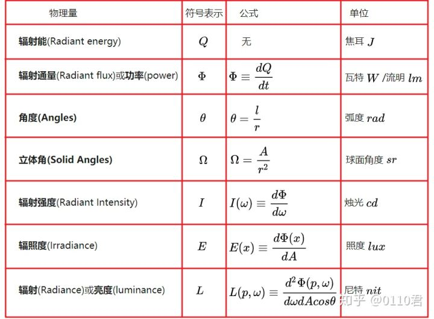

# 光照


$$
L_o(p,\omega_o) = \int\limits_{\Omega} 
        (k_d\frac{c}{\pi} + k_s\frac{DFG}{4(\omega_o \cdot n)(\omega_i \cdot n)})
        L_i(p,\omega_i) n \cdot \omega_i  d\omega_i
$$
​		我们大致上清楚这个反射方程在干什么，但我们仍然留有一些迷雾尚未揭开。比如说我们究竟将怎样表示场景上的辐照度(Irradiance), 辐射率(Radiance) $L$? 我们知道**辐射率$L$（在计算机图形领域中）表示在给定立体角$\omega$情况下光源的辐射通量(Radiant flux)$\phi$或光源在角度$\omega$下发送出来的光能**。 在我们的情况下，不妨假设立体角$\omega$无限小，这样辐射度就表示光源在一条光线或单个方向向量上的辐射通量。

​		基于以上的知识，我们如何将其转化为以前的教程中积累的一些光照知识呢？ 那么想象一下，我们有一个点光源（一个光源在所有方向具有相同的亮度），它的辐射通量为用RBG表示为**（23.47,21.31,20.79）**。该光源的辐射强度(Radiant Intensity)等于其在所有出射光线的辐射通量。 然而，当我们为一个表面上的特定的点$p$着色时，在其半球领域$\Omega$的所有可能的入射方向上，只有一个入射方向向量$\omega_i$直接来自于该点光源。 假设我们在场景中只有一个光源且位于空间中的某一个点，因而对于$p$点的其他可能的入射光线方向上的辐射率为0：


​		如果从一开始，我们就假设**点光源不受光线衰减（光照强度会随着距离变暗）的影响**，那么无论我们把光源放在哪，入射光线的辐射率总是一样的（除去入射角$cos\theta$对辐射率的影响之外）。 正是因为无论我们从哪个角度观察它，点光源总具有相同的辐射强度，我们可以有效地将其辐射强度建模为其辐射通量: 一个常量向量**（23.47,21.31,20.79）**。

​		然而，辐射率也需要将位置$p$作为输入，正如所有现实的点光源都会受光线衰减影响一样，**点光源的辐射强度应该根据点$p$所在的位置和光源的位置以及他们之间的距离而做一些缩放。** 因此，根据原始的辐射方程，我们会根据**表面法向量$n$和入射角度$\omega_i$来缩放光源的辐射强度**。

​		在实现上来说：对于直接点光源的情况，辐射率函数$L$先获取光源的颜色值， 然后光源和某点$p$的距离衰减，接着按照$n \cdot w_i$缩放，但是仅仅有一条入射角为$w_i$的光线打在点$p$上， 这个$w_i$同时也等于在$p$点光源的方向向量。写成代码的话会是这样：

```glsl
vec3 lightColor = vec3(23.47, 21.31, 20.79);
vec3 wi = normalize(lightPos - fragPos);
float cosTheta = max(dot(wi, n), 0.0);
//光衰减计算
float attenuation = calculateAttenuation(fragPos, lightPos);
float radiance = lightColor * attenuation * cosTheta;
```

​		除了一些叫法上的差异以外，**这段代码对你们来说应该很TM熟悉**：这正是我们一直以来怎么计算(漫反射(diffuse))光照的！**当涉及到直接照明(direct lighting)时，辐射率的计算方式和我们之前计算当只有一个光源照射在物体表面的时候非常相似**。

> 这里是假设了点光源的体积是无限小的，所以对于点p来说只会有一个方向上的辐射率不为0，但是在实际情况中，点光源是具有体积的，所以一定是不会只有一个方向上的辐射率不为0的。

​		对于其它类型的从单点发出来的光源我们类似地计算出辐射率。比如，**定向光(directional light)拥有恒定的$\omega_i$而不会有衰减因子；而一个聚光灯光源则没有恒定的辐射强度，其辐射强度是根据聚光灯的方向向量来缩放**的。

​		这也让我们回到了对于表面的半球领域(hemisphere)$\Omega$的积分$\int$上。由于我们**事先知道的所有贡献光源的位置**，因此对物体表面上的一个点着色并不需要我们尝试去求解积分。我们可以**直接拿光源的（已知的）数目，去计算它们的总辐照度，因为每个光源仅仅只有一个方向上的光线会影响物体表面的辐射率**。这使得PBR对直接光源的计算相对简单，因为我们只需要有效地遍历所有有贡献的光源。而当我们后来把环境照明也考虑在内的[IBL](https://learnopengl-cn.github.io/07 PBR/02 Lighting/)教程中，我们就必须采取积分去计算了，**这是因为光线可能会在任何一个方向入射**。

## 一个PBR表面模型

​		现在让我们开始写片段着色器来实现上述的PBR模型吧~ 首先我们需要把PBR相关的输入放进片段着色器。

```glsl
#version 330 core;
out vec4 FragColor;
in vec2 TexCoords;
in vec3 FragPos;
in vec3 Normal;

uniform vec3 viewPos;
//反照率
uniform vec3 albedo;
//金属度
uniform float metallic;
//粗糙度
uniform float roughness;
//环境光遮蔽
uniform float ao;
```

​		我们把通用的顶点着色器的输出作为输入的一部分。另一部分输入则是物体表面模型的一些材质参数。

​		然后再片段着色器的开始部分我们做一下任何光照算法都需要做的计算:

```glsl
void main(){
    //法向量
	vec3 N = normalize(Normal);
    //观察向量
	vec3 V = normalize(viewPos - FragPos);
    [...]
}
```

## 直接光照明（direct）

​		我们会采用总共4个点光源来直接表示场景的辐照度。**为了满足反射率方程，我们循环遍历每一个光源，计算他们独立的辐射率然后求和**，接着**根据BRDF和光源的入射角来缩放该辐射率**。我们可以**把循环当作在对物体的半球领域对所以直接光源求积分**。首先我们来计算一些可以预计算的光照变量：

```glsl
vec3 Lo = vec3(0.0);
for(int i = 0; i < 4; ++i){
    //光线向量
    vec3 L = normal(lightPositions[i] - FragPos);
    //半程向量
    vec3 H = normalize(V + L);
    
    //光照距离
    float distance = length(lightPositions[i] - FragPos);
    //光衰
    float attenuation = 1.0 / (pow(distance, 2.0));
    //辐射率
    vec3 radiance = lightColors[i] * attenuation; 
    
    [...]
}
```

​		由于我们线性空间内计算光照（我们会**在着色器的尾部进行Gamma校正**），我们使用在物理上更为准确的平方倒数作为衰减。

> 相对于物理上正确来说，你可能仍然想使用常量，线性或者二次衰减方程（他们在物理上相对不准确），却可以为您提供在光的能量衰减更多的控制。

​		然后，对于每一个光源我们都想计算完整的 Cook-Torrance specular BRDF项：
$$
\frac{DFG}{4(\omega_o \cdot n)(\omega_i \cdot n)}
$$


```

```

