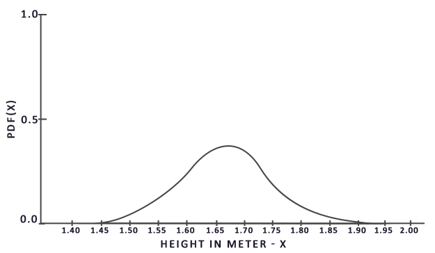

# 镜面反射IBL

​		在这里我们的重点将是在反射方程中的镜面部分
$$
L_o(p,\omega_o) = \int\limits_{\Omega} 
        (k_d\frac{c}{\pi} + k_s\frac{DFG}{4(\omega_o \cdot n)(\omega_i \cdot n)})
        L_i(p,\omega_i) n \cdot \omega_i  d\omega_i
$$
​		可以注意到 Cook-Torrance 镜面部分（乘以$k_s$）在整个积分上不是常数，**不仅受入射光方向影响，还受视角影响**。如果试图解算所有入射光方向加所有可能的视角方向的积分，二者组合数会极其庞大，实时计算太昂贵。Epic Games 提出了一个解决方案，他们**预计算镜面部分的卷积，为实时计算作了一些妥协**，这种方案被称为**分割求和近似法**（split sum approximation）。 分割求和近似**将方程的镜面部分分割成两个独立的部分**，我们可以单独求卷积，然后**在 PBR 着色器中求和，以用于间接镜面反射部分 IBL**。分割求和近似法类似于我们之前求辐照图预卷积的方法，**需要 HDR 环境贴图作为其卷积输入**。为了理解，我们回顾一下反射方程，但这次只关注镜面反射部分
$$
L_o(p,\omega_o) = 
        \int\limits_{\Omega} k_s\frac{DFG}{4(\omega_o \cdot n)(\omega_i \cdot n)}
            L_i(p,\omega_i) n \cdot \omega_i  d\omega_i
            =
       k_s \int\limits_{\Omega} f_r(p, \omega_i, \omega_o) L_i(p,\omega_i) n \cdot \omega_i  d\omega_i
$$
​		由于与辐照度卷积相同的（性能）原因，我们无法以合理的性能实时求解积分的镜面反射部分。因此，我们最好**预计算这个积分，以得到像镜面 IBL 贴图**这样的东西，用片段的法线对这张图采样并计算。但是，有一个地方有点棘手：我们能够预计算辐照度图，是因为其积分仅依赖于$\omega_i$，并且可以将漫反射反射率常数项移出积分，但这一次，**积分不仅仅取决于$\omega_i$，**从 BRDF 可以看出：
$$
f_r(p, w_i, w_o) = \frac{DFG}{4(\omega_o \cdot n)(\omega_i \cdot n)}
$$
​		这次**积分还依赖$\omega_o$，**我们无法用两个方向向量采样预计算的立方体图。如前一个教程中所述，位置$p$与此处无关。在实时状态下，对每种可能的$\omega_i$和$\omega_o$的组合预计算该积分是不可行的。 **Epic Games 的分割求和近似法将预计算分成两个单独的部分求解，再将两部分组合起来得到后文给出的预计算结果**。分割求和近似法将镜面反射积分拆成两个独立的积分：
$$
L_o(p,\omega_o) = 
       k_s \int\limits_{\Omega} L_i(p,\omega_i) d\omega_i
        *
        \int\limits_{\Omega} f_r(p, \omega_i, \omega_o) n \cdot \omega_i d\omega_i
$$
​		卷积的第一部分被称为**预滤波环境贴图**（就是前一部分辐照度的部分），它类似于辐照度图，**是预先计算的环境卷积贴图**，但这次**考虑了粗糙度**。因为**随着粗糙度的增加，参与环境贴图卷积的采样向量会更分散，导致反射更模糊，所以对于卷积的每个粗糙度级别，我们将按顺序把模糊后的结果存储在预滤波贴图的 mipmap 中**。例如，预过滤的环境贴图在其 5 个 mipmap 级别中存储 5 个不同粗糙度值的预卷积结果，如下图所示：


​		我们使用 Cook-Torrance BRDF 的正态分布函数(NDF)生成**采样向量及其散射强度**，该函数将法线和视角方向作为输入。由于我们在卷积环境贴图时事先不知道视角方向，因此 Epic Games **假设视角方向——也就是镜面反射方向——总是等于输出采样方向$\omega_o$，以作进一步近似**。翻译成代码如下：

```glsl
vec3 N = normalize(w_o);
vec3 R = N;
vec3 V = R;
```

​		这样，**预过滤的环境卷积就不需要关心视角方向了**。这意味着当从如下图的角度观察表面的镜面反射时，得到的**掠角镜面反射效果不是很好**。然而，通常可以认为这是一个体面的妥协：


​		卷积的**第二部分等于镜面反射积分的 BRDF 部分**。如果我们**假设每个方向的入射辐射度都是白色的（因此$L(p, x) = 1.0$)，就可以在给定粗糙度、光线 $\omega_i$法线 $n$夹角$n \cdot \omega_i$的情况下，预计算 BRDF 的响应结果**。Epic Games 将**预计算好的 BRDF 对每个粗糙度和入射角的组合的响应结果存储在一张 2D 查找纹理(LUT)上**，称为**BRDF积分贴图**。**2D 查找纹理存储是菲涅耳响应的系数（R 通道）和偏差值（G 通道）**，它为我们提供了分割版镜面反射积分的第二个部分：


​		生成查找纹理的时候，我们**以 BRDF 的输入$n⋅\omega_i$（范围在 0.0 和 1.0 之间）作为横坐标，以粗糙度作为纵坐标**。有了此 BRDF 积分贴图和预过滤的环境贴图，我们就可以将两者结合起来，以获得镜面反射积分的结果：

```glsl
float lod = getMipLevelFromRoughness(roughness);
//这里就是使用了Mipmap, 第一个参数是预滤波环境贴图，第二参数是采样坐标，第三个参数是Mipmap层级
vec3 prefilteredColor = textureCubeLod(PrefilteredEnvMap, refVec, lod);
//查找贴图
vec2 envBRDF          = texture2D(BRDFIntegrationMap, vec2(NdotV, roughness)).xy;
vec3 indirectSpecular = prefilteredColor * (F * envBRDF.x + envBRDF.y) 
```

## 预滤波HDR环境贴图

​		预滤波环境贴图的方法与我们对辐射度贴图求卷积的方法非常相似。对于卷积的每个粗糙度级别，我们将按顺序把模糊后的结果存储在预滤波贴图的`mipmap` 中。 首先，我们需要**生成一个新的立方体贴图来保存预过滤的环境贴图数据**。为了确保为其 mip 级别分配足够的内存，一个简单方法是`glGenerateMipmap`。

```c++
unsigned int prefilterMap;
glGenTextures(1, &prefilterMap);
glBindTexture(GL_TEXTURE_CUBE_MAP, prefilterMap);
for(int i = 0 ;i < 6; i++){
	glTexImage2D(GL_TEXTURE_CUBE_MAP_POSITIVE_X + i, 0, GL_RGB16F, 128, 128, 0, GL_RGB, GL_FLOAT, NULL);
}
glTexParameteri(GL_TEXTURE_CUBE_MAP, GL_TEXTURE_WRAP_S, GL_CLAMP_TO_EDGE);
glTexParameteri(GL_TEXTURE_CUBE_MAP, GL_TEXTURE_WRAP_T, GL_CLAMP_TO_EDGE);
glTexParameteri(GL_TEXTURE_CUBE_MAP, GL_TEXTURE_WRAP_R, GL_CLAMP_TO_EDGE);
//三线性过滤
glTexParameteri(GL_TEXTURE_CUBE_MAP, GL_TEXTURE_MIN_FILTER, GL_LINEAR_MIPMAP_LINEAR); 
glTexParameteri(GL_TEXTURE_CUBE_MAP, GL_TEXTURE_MAG_FILTER, GL_LINEAR);

glGenerateMipmap(GL_TEXTURE_CUBE_MAP);
```

​		注意，因为我们计划采样 prefilterMap 的 mipmap，所以**需要确保将其缩小过滤器设置为 `GL_LINEAR_MIPMAP_LINEAR` 以启用三线性过滤**。它存储的是预滤波的镜面反射，基础 mip 级别的分辨率是每面 128×128，对于大多数反射来说可能已经足够了，但如果场景里有大量光滑材料（想想汽车上的反射），可能需要提高分辨率。

​		镜面反射依赖于表面的粗糙度，反射光线可能比较松散，也可能比较紧密，但是一定会围绕着反射向量$r$，除非表面极度粗糙：


​		所有可能出射的反射光构成的形状称为镜面波瓣。**随着粗糙度的增加，镜面波瓣的大小增加；随着入射光方向不同，形状会发生变化**。因此，**镜面波瓣的形状高度依赖于材质**。 **在微表面模型里给定入射光方向，则镜面波瓣指向微平面的半程向量的反射方向**。考虑到大多数光线最终会**反射到一个基于半程向量的镜面波瓣内**，采样时以类似的方式选取采样向量是有意义的，因为大部分其余的向量都被浪费掉了，这个过程称为**重要性采样**。

> 半程向量一定是在镜面波瓣内的，镜面波瓣一定是基于半程向量方向而产生的。

### 蒙特卡洛积分和重要性采样

​		为了充分理解重要性采样，我们首先要了解一种数学结构，称为**蒙特卡洛积分**。蒙特卡洛积分主要是统计和概率理论的组合。蒙特卡洛可以帮助我们离散地解决人口统计问题，而不必考虑**所有**人。

​		例如，假设您想要计算一个国家所有公民的平均身高。为了得到结果，你可以测量**每个**公民并对他们的身高求平均，这样会得到你需要的**确切**答案。但是，由于大多数国家人海茫茫，这个方法不现实：需要花费太多精力和时间。

​		另一种方法是选择一个小得多的**完全随机**（无偏）的人口子集，测量他们的身高并对结果求平均。可能只测量 100 人，虽然答案并非绝对精确，但会得到一个相对接近真相的答案，这个理论被称作**大数定律**。我们的想法是，如果从总人口中测量一组较小的真正随机样本的 $N$，结果将相对接近真实答案，并随着样本数 $N$的增加而愈加接近。

​		**蒙特卡罗积分建立在大数定律的基础上，并采用相同的方法来求解积分**。不为所有可能的（理论上是无限的）样本值$x$求解积分，而是简单地从总体中随机挑选样本 $N$生成采样值并求平均。随着$N$的增加，我们的结果会越来越接近积分的精确结果：
$$
O =  \int\limits_{a}^{b} f(x) dx 
      = 
      \frac{1}{N} \sum_{i=0}^{N-1} \frac{f(x)}{pdf(x)}
$$
​		为了求解这个积分，我们在 $a$到 $b$上采样 $N$个随机样本，将它们加在一起并除以样本总数来取平均。**$pdf$代表概率密度函数 (probability density function)，它的含义是特定样本在整个样本集上发生的概率。**例如，人口身高的 pdf 看起来应该像这样：



 		从该图中我们可以看出，如果我们对人口任意随机采样，那么挑选身高为 1.70 的人口样本的可能性更高，而样本身高为 1.50 的概率较低。

​		当涉及蒙特卡洛积分时，某些样本可能比其他样本具有更高的生成概率。这就是为什么对于任何一般的蒙特卡洛估计，我们都会**根据 pdf 将采样值除以或乘以采样概率**。到目前为止，我们每次需要估算积分的时候，**生成的样本都是均匀分布的，概率完全相等**。到目前为止，我们的估计是无偏的，这**意味着随着样本数量的不断增加，我们最终将收敛到积分的精确解。**

​		但是，**某些蒙特卡洛估算是有偏的，这意味着生成的样本并不是完全随机的，而是集中于特定的值或方向**。这些有偏的蒙特卡洛估算具有**更快的收敛速度**，它们会以更快的速度收敛到精确解，但是由于其有偏性，可能**永远不会收敛到精确解**。通常来说，这是一个可以接受的折衷方案，尤其是**在计算机图形学中。因为只要结果在视觉上可以接受，解决方案的精确性就不太重要**。下文我们将会提到一种（有偏的）重要性采样，其生成的样本偏向特定的方向，在这种情况下，我们会将每个样本乘以或除以相应的 pdf 再求和。

​		蒙特卡洛积分在计算机图形学中非常普遍，因为它是一种**以高效的离散方式对连续的积分求近似而且非常直观的方法**：对任何面积/体积进行采样——例如半球 $\Omega$——在该面积/体积内生成数量$N$的随机采样，权衡每个样本对最终结果的贡献并求和。

​		蒙特卡洛积分是一个庞大的数学主题，在此不再赘述，但有一点需要提到：**生成随机样本的方法也多种多样**。默认情况下，**每次采样都是我们熟悉的完全（伪）随机，不过利用半随机序列的某些属性，我们可以生成虽然是随机样本但具有一些有趣性质的样本向量**。例如，我们可以对一种名为**低差异序列**的东西进行蒙特卡洛积分，该序列生成的仍然是随机样本，但**样本分布更均匀**：


​		当使用低差异序列生成蒙特卡洛样本向量时，该过程称为拟蒙特卡洛积分。**拟蒙特卡洛方法具有更快的收敛速度，这使得它对于性能繁重的应用很有用**。

​		鉴于我们新获得的有关蒙特卡洛（Monte Carlo）和拟蒙特卡洛（Quasi-Monte Carlo）积分的知识，我们可以使用一个有趣的属性来获得更快的收敛速度，这就是重要性采样。我们在前文已经提到过它，但是**在镜面反射的情况下，反射的光向量被限制在镜面波瓣中，波瓣的大小取决于表面的粗糙度**。既然镜面波瓣外的任何（拟）随机生成的样本与镜面积分无关，因此**将样本集中在镜面波瓣内生成是有意义的，但代价是蒙特卡洛估算会产生偏差**。

​		本质上来说，这就是重要性采样的核心：**只在某些区域生成采样向量，该区域围绕微表面半向量，受粗糙度限制**。通过**将拟蒙特卡洛采样与低差异序列相结合，并使用重要性采样偏置样本向量的方法，我们可以获得很高的收敛速度**。因为我们求解的速度更快，所以要达到足够的近似度，我们所需要的样本更少。因此，这套组合方法**甚至可以允许图形应用程序实时求解镜面积分**，虽然比预计算结果还是要慢得多。

### 低差异序列

​		在本教程中，我们将使用重要性采样来预计算间接反射方程的镜面反射部分，该采样基于拟蒙特卡洛方法给出了随机的低差异序列。我们将使用的序列被称为 Hammersley 序列，[Holger Dammertz](http://holger.dammertz.org/stuff/notes_HammersleyOnHemisphere.html) 曾仔细描述过它。Hammersley 序列是基于 Van Der Corput 序列，该序列是把十进制数字的二进制表示,镜像翻转到小数点右边而得。

​		给出一些巧妙的技巧，我们可以在着色器程序中非常有效地生成 Van Der Corput 序列，我们将用它来获得 Hammersley 序列，设总样本数为 N，样本索引为 i：