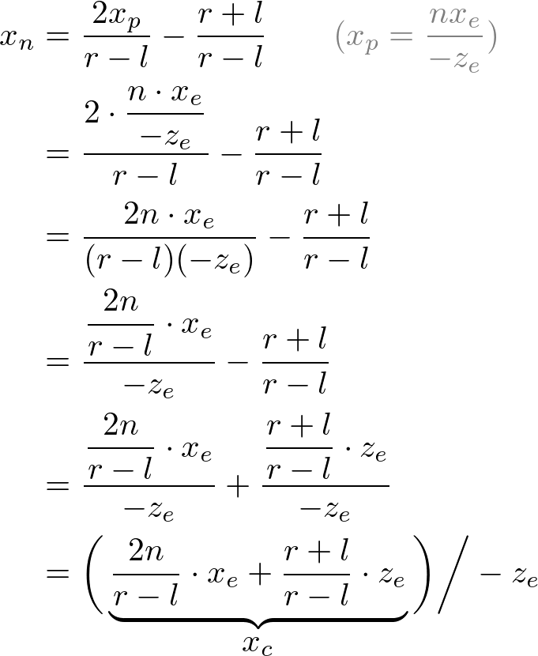

### 关于投影矩阵的解析

> **注：不翻译原文，就把关键性的知识做一下说明**
>
> 在看本文档之前，需要先去学习一下坐标系统的基础知识，这里附上链接：[坐标系统基础知识](https://learnopengl-cn.github.io/01%20Getting%20started/08%20Coordinate%20Systems/)
>
> 原文地址:http://www.songho.ca/opengl/gl_projectionmatrix.html

**原文中一些专有词汇的翻译记录**

| 单词、词组              | 意思     |
| ----------------------- | -------- |
| homogeneous coordinates | 齐次坐标 |

**本文中出现的一些字母缩写所包含意思说明**

| 缩写  | 包含意思                                                    |
| ----- | ----------------------------------------------------------- |
| $x_c$ | 下标c，clip，裁剪空间坐标系中的顶点坐标                     |
| $x_e$ | 下标e，eye，观察空间坐标系中的顶点位置                      |
| n     | near，，平截头体近平面                                      |
| f     | far，平截头体远平面                                         |
| $x_n$ | 下标n，电脑屏幕坐标系中的顶点位置(最终呈现的位置的顶点坐标) |
| $x_p$ | 下标p，投影坐标，观察空间坐标系投影在近平面上的坐标         |
| l     | left，平截头体的最顶点值                                    |
| r     | right，平截头体的最顶点值                                   |
| t     | top，平截头体的最上顶点值                                   |
| b     | bottom，平截头体的最底顶点值                                |
| NDC   | 标准化设备坐标                                              |

​		如图所示，这是一个三角形的平截头体，在视野范围内的片段将会被保留，而在视野范围外的所有片段都将会被丢弃。

### 非线性关系

​		在透视投影中，平截头体中的3d坐标点会全部映射到**NDC**中，就如下图所示：

​		通过图片可以获取到，**l**和**r**在NDC中**投影到x轴的所处范围为[l,r]$$\in$$[-1,1]**，**b**和**t**在NDC中**投影到Y轴的所处范围为[b,t]$$\in$$[-1,1]**，**n**和**f**在NDC中**投影到z轴的所处范围为[n,f]$$\in$$[-1,1]**

​		当我们在OpenGL中，将一个3D的点从观察空间坐标系投影到近平面上的时候，就会如下图所示，获取到在近平面的投射坐标:

​		在上面两张图片中，我们看到观察坐标投射到近平面时，所对应的$x_p$和$y_p$以及$z_p$关于视觉坐标的关系。这里求得$x_p$和$y_p$，使用的方式就是初中所学的知识**相似三角形理论**。下面就是推导的公式:

​		这时候，我们可以得知，$x_p$和$y_p$都和$-z_e$相关。在另外一个方面来说，观察空间坐标通过投影矩阵变换后，裁剪坐标依然是齐次坐标并且最终会化为NDC坐标系中的坐标点(通过w分量的处理)。观察空间坐标通过投影矩阵变换如下两图所示:

所以，我们其实就可以把$-z_e$看作为$w_c$分量。一次我们就可以把这个投影矩阵(4*4矩阵)的第四行写为:

接下来，我们需要处理$x_p$和$y_p$变化到NDC下的$x_n$，$y_n$之间的线性变化关系，而且这个时候我们已经在上文提到过了在NDC的x轴上**[l,r]$$/in$$[-1,1]**，y轴上**[b,t]$$/in$$[-1,1]**，这样就跟加有利于推导出其中的关系。

首先是$x_p$与$x_n$之间的线性关系:

因为我们已知了**[l,r]$$\in$$[-1,1]**，这一层关系，所以就很容易可以通过两点求出$x_n$和$x_p$之间的线性关系。

同理，我们也可以很轻易地获得$y_n$与$y_p$之间的线性关系

现在我们就获得关于$x_p$与$y_p$与$x_n$,$y_n$直接的线性关系。继而我们可以再通过一开始获得$x_p$,$y_p$与$x_e$,$y_e$之间的关系来获取到$x_e$,$y_e$与$x_n$,$y_n$之间的联系了：

到了这一步之后，我们也可以知道了刚刚的那个投影矩阵中的一、二两行中数据应该怎么填了，根据上面我们获取到的表达式:

现在，我们离成功求出投影矩阵就差最后第三行的数据了。

通过观察上面的近平面投射示意图，我们其实可以比较简单的发现观察空间坐标$z_e$投射到近平面的点都为-n，但是我们需要将z的值关联到裁剪坐标和深度相关，所以我们需要去进行逆变换，使得z的值不与x、y相关，我们去用w分量去寻找$z_n$和$z_e$之间的关系。所以，可以先进行如下设置:

通过矩阵的成法，我们可以获得$z_n$与$z_e$的关系,而且在之前的图中，我们也可以得知(-n, -1) 和(-f, 1)的范围，所以这里直接去两点，带入表达式中，两个方程可以解出两个未知数A与B

获得了A、B的值之后(用f、n来表达),带入原表达式可以得知:

所以，我们就最终可以获得投影变化矩阵中的每一行数据了

最后得出的投影矩阵是一个通用的投影矩阵，适用于普通场景的投影变换。如果一个观察空间是一个对称空间，那么可以得知r=-l,t=-b，所以就可以很容易获得：

通过上述的推导，我们不难发现$z_n$和$z_e$之间的关系不是一个线性关系，是一个非线性关系。这就是说在近平面有很高的精度，但在远平面上精度很低。在远平面，$z_e$的微小变化不会影响$z_n$值。n和f之间的距离应尽可能短，以最小化深度缓冲精度问题。具体如下图所示:

### 线性关系

观察空间中的所有$x_e$、$y_e$和$z_e$分量都被线性映射到NDC。我们只需要把一个长方形的体积缩放成一个立方体，然后把它移到原点。我们用线性关系求出投影矩阵。

如下图所示，这是在线性关系下，$x_n$与$x_e$的关系	

如下图所示，这是在线性关系下，$y_n$与$y_e$的关系	

如下图所示，这是在线性关系下，$z_n$与$z_e$的关系	

因为是线性关系，所以w分量在投影中不是那么重要，所以可以设置为(0,0,0,1)。所以投影矩阵可以表达为

同样，在线性关系下，如果一个观察空间是一个对称空间，那么可以得知r=-l,t=-b，所以就可以很容易获得：

> 线性关系下的描述可能有一些问题，所以不懂得可以问哟