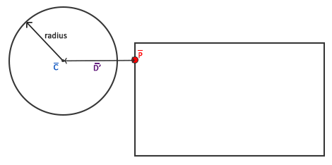

# 碰撞检测

​		当试图判断两个物体之间是否有碰撞发生时，我们通常不使用物体本身的数据，因为这些物体常常会很复杂，这将导致碰撞检测变得很复杂。正因这一点，使用**重叠**在物体上的更简单的外形（通常有较简单明确的数学定义）来进行碰撞检测成为常用的方法。我们**基于这些简单的外形来检测碰撞，这样代码会变得更简单且节省了很多性能**。这些碰撞外形例如圆、球体、长方形和立方体等，与拥有上百个三角形的网格相比简单了很多。

> 用一个几何体去代替物体的碰撞，因为物体表面具有许多的三角形的网格

​		虽然它们确实提供了更简单更高效的碰撞检测算法，但这些简单的碰撞外形拥有一个共同的缺点，这些外形通常无法完全包裹物体。产生的影响就是当检测到碰撞时，实际的物体并没有真正的碰撞。必须记住的是**这些外形仅仅是真实外形的近似**。

## AABB - AABB 碰撞

​		AABB代表的是**轴对齐碰撞箱**(Axis-aligned Bounding Box)，**碰撞箱是指与场景基础坐标轴（2D中的是x和y轴）对齐的长方形的碰撞外形**。与坐标轴对齐意味着**这个长方形没有经过旋转并且它的边线和场景中基础坐标轴平行（例如，左右边线和y轴平行）**。这些碰撞箱总是和场景的坐标轴平行，这使得所有的计算都变得更简单。下边是我们用一个AABB包裹一个球对象（物体）：

> 可以理解就是老式电视机待机画面的时候，那个撞来撞去的字幕也使用的轴对齐碰撞箱


​		Breakout中几乎所有的物体都是基于长方形的物体，因此很理所应当地使用轴对齐碰撞箱来进行碰撞检测。这就是我们接下来要做的。

​		有多种方式来定义与坐标轴对齐的碰撞箱。其中一种定义AABB的方式是获取左上角点和右下角点的位置。我们定义的GameObject类**已经包含了一个左上角点位置（它的Position vector）并且我们可以通过把左上角点的矢量加上它的尺寸（Position + Size）很容易地计算出右下角点**。每个GameObject都包含一个AABB我们可以高效地使用它们碰撞。

> 右下角点 = (左上角点.x + Size.x, 左上角点.y - Size.y) 

​		那么我们如何判断碰撞呢？**当两个碰撞外形进入对方的区域时就会发生碰撞**，例如定义了第一个物体的碰撞外形以某种形式进入了第二个物体的碰撞外形。对于AABB来说很容易判断，因为它们是与坐标轴对齐的：**对于每个轴我们要检测两个物体的边界在此轴向是否有重叠**。因此我们只是**简单地检查两个物体的水平边界是否重合以及垂直边界是否重合**。如果水平边界**和**垂直边界都有重叠那么我们就检测到一次碰撞。

> 这里其实也很好理解，就是需要去检查我们需要检测的碰撞物体的碰撞箱的两侧边界，是否与在原地的物体的边界重叠，要是重叠了，则就可以判定为碰撞了。


```c++
bool CheckCollision(GameObject &one, GameObject &two){
  	bool collisionX = one.Position.x + one.Size.x >= two.Position.x && two.Position.x + two.Size.x >= one.Position.x;
  	bool collisionY = one.Position.y + one.Size.y >= two.Position.y && two.Position.y + two.Size.y >= one.Position.y;
  
  	return collisionX && collisionY;
}
```

​		我们检查第一个物体的最右侧是否大于第二个物体的最左侧**并且**第二个物体的最右侧是否大于第一个物体的最左侧；垂直的轴向与此相似。如果您无法顺利地将这一过程可视化，可以尝试在纸上画边界线/长方形来自行判断。

​		为更好地组织碰撞的代码，我们在Game类中加入一个额外的函数：

```c++
class Game{
		[...]
		void DoCollisions();
}
```

​		可以使用DoCollisions来检查球与关卡中的砖块是否发生碰撞。如果检测到碰撞，就将砖块的Destroyed属性设为true，此举会停止关卡中对此砖块的渲染。

```c++
void Game::BoCollisions(){
  	for(GameObject &box : this->Levels[this->Level].Bricks){
      	if(!box.Destoryed){
          	if(CheckCollision(*Ball, box)){
              	if(!box.IsSolid){
                  	box.Destoryed = true;
                }
            }
        }
    }
}
//更新Game的Update代码
void Game::Update(float dt){
  	Ball->Move(dt, this->Width);
  	this->DoCollisions;
}
```

## AABB - 圆碰撞检测

​		由于球是一个圆形的物体，AABB或许不是球的最佳碰撞外形。碰撞的代码中将球视为长方形框，因此常常会出现球碰撞了砖块但此时球精灵还没有接触到砖块。


​		使用圆形碰撞外形而不是AABB来代表球会更合乎常理。因此我们在球对象中包含了Radius变量，为了定义圆形碰撞外形，我们需要的是一个位置矢量和一个半径。


> 圆心指向圆边框的向量，长度就是半径长度，向量起始点就是圆心坐标

​		这意味着我们不得不修改检测算法，因为当前的算法只适用于两个AABB（**轴对齐碰撞箱**）的碰撞。检测圆和AABB碰撞的算法会稍稍复杂，关键点如下：我们会找到AABB上距离圆最近的一个点，如果圆到这一点的距离小于它的半径，那么就产生了碰撞。

> 就是找到碰撞箱上距离这个圆形圆心最近的一点，如果这个点小于圆的半径长度，就判定为碰撞了。

​		难点在于获取AABB上的最近点$\bar{P}$。下图展示了对于任意的AABB和圆我们如何计算该点：


​		首先我们要获取球心$\bar{C}$与AABB中心$\bar{B}$的矢量差$\bar{D}$。**接下来用AABB的半边长(half-extents)$w$和$\bar{h}$来限制(clamp)矢量$\bar{D}$。长方形的半边长是指长方形的中心到它的边的距离；简单的说就是它的尺寸除以2。**这一过程返回的是一个总是位于AABB的边上的位置矢量（除非圆心在AABB内部）。

​		限制运算把一个值**限制**在给定范围内，并返回限制后的值。通常可以表示为：

```c++
float clamp(float value, float min, float max) {
    return std::max(min, std::min(max, value));
}
```

​		例如，值42.0f被限制到6.0f和3.0f之间会得到6.0f；而4.20f会被限制为4.20f。限制一个2D的矢量表示将其x和y分量都限制在给定的范围内。

> 这个限制就是把这个目标矢量的长度和高度分别限制在碰撞箱的长度/2 , 高度/2 的范围内，获得的那个点就是距离圆最近的点。

这个限制后矢量$\bar{D}$就是AABB上距离圆最近的点。接下来我们需要做的就是计算一个新的差矢量$\bar{D'}$，它是圆心$\bar{C}$和$\bar{P}$的差矢量。



```c++
bool CheckCollision(BallObject &one, GameObject &two){
  	glm::vec2 center(one.Position + one.Radius);
  	glm::vec2 aabb_center(two.Position.x + two.Size.x / 2, two.Position.y + two.Size.y / 2);
  	glm::vec2 aabb_half_extents(two.Size.x / 2, two.Size.y / 2);
  
  	glm::vec2 difference = center - aabb_center;
  
  	glm::vec2 clamped = glm::clamp(difference, -aabb_half_extents, aabb_half_extents);
  	// AABB_center加上clamped这样就得到了碰撞箱上距离圆最近的点closest
    glm::vec2 closest = aabb_center + clamped;
    // 获得圆心center和最近点closest的矢量并判断是否 length <= radius
    difference = closest - center;
    return glm::length(difference) < one.Radius;
}
```

		我们创建了CheckCollision的一个重载函数用于专门处理一个BallObject和一个GameObject的情况。因为我们并没有在对象中保存碰撞外形的信息，因此我们必须为其计算：**首先计算球心，然后是AABB的半边长及中心**。

​		使用这些碰撞外形的参数，我们计算出difference$\bar{D}$然后得到限制后的值clamped，并与AABB中心相加得到closest$\bar{P}$。然后计算出center和closest的矢量差$\bar{D'}$并返回两个外形是否碰撞。

​		之前我们调用CheckCollision时将球对象作为其第一个参数，因此现在CheckCollision的重载变量会自动生效，我们无需修改任何代码。现在的结果会比之前的碰撞检测算法更准确。

