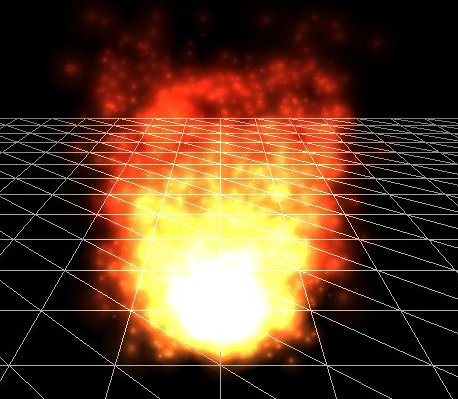

# 粒子

​		一个微粒,从OpenGL的角度看就是一个**总是面向摄像机方向且(通常)包含一个大部分区域是透明的纹理的小四边形**。一个微粒本身主要就是一个精灵(sprite),前面我们已经早就使用过了，但是当你把成千上万个这些微粒放在一起的时候,就可以创造出令人疯狂的效果.

​		当**处理这些微粒**的时候，通常**是由一个叫做粒子发射器或粒子生成器的东西完成**的，从这个地方,**持续不断的产生新的微粒并且旧的微粒随着时间逐渐消亡**。如果这个粒子发射器产生一个带着类似烟雾纹理的微粒的时候，它的颜色亮度同时又随着与发射器距离的增加而变暗，那么就会产生出灼热的火焰的效果:



​		**一个单一的微粒通常有一个生命值变量**，并且**从它产生开始就一直在缓慢的减少**。一旦它的**生命值少于某个极限值（通常是0）我们就会杀掉这个粒子**,这样下一个粒子产生时就可以让它来替换那个被杀掉的粒子。一个粒子发射器控制它产生的所有粒子并且根据它们的属性来改变它们的行为。一个粒子通常有下面的属性：

```c++
struct Particle {
  	//位置、速度
  	glm::vec2 Position, Velocity;
  	//粒子颜色
  	glm::vec4 Color;
 		//粒子生命时间
  	float Life;
  	Particle(): Position(0.0f), Velocity(0.0f), Color(0.0f),Life(0.0f){}
}
```

​		看上面那个火焰的例子，那个粒子发射器可能**在靠近发射器的地方产生每一个粒子，并且有一个向上的速度，这样每个粒子都是朝着正$y$轴方向移动**。那似乎有3个不同区域，只是可能相比其他的区域，给了某个区域内的粒子更快的速度。我们也可以看到，**$y$轴方向越高的粒子，它们的黄色或者说亮度就越低。一旦某个粒子到达某个高度的时候，它的生命值就会耗尽然后被杀掉**；绝不可能直冲云霄。

​		你可以想象到用这样一个系统，我们就可以创造一些有趣的效果比如火焰，青烟，烟雾，魔法效果，炮火残渣等等。在Breakout游戏里，我们将会使用下面那个小球来创建一个简单的粒子生成器来制作一些有趣的效果。

​		粒子生成器在**这个球的位置产生无数的粒子**，**根据球移动的速度给了粒子相应的速度**，并且根据它们的生命值来改变他们的颜色亮度。

```glsl
//为了创建这个粒子发生器，需要创建新的着色器
#version 330 core
layout(location = 0) in vec4 vertex;

out vec2 TexCoords;
out vec4 ParticleColor;

uniform mat4 projection;
uniform vec2 offset;
uniform vec4 color;

void main(){
  	float scale = 10.0f;
  	TexCoords = vertex.zw;
  	ParticleColor = volor;
  	//这个位置就是正交投影叉乘 粒子原本的位置及其缩放比例+偏移量
  	gl_Position = projection * vec4((vertex.xy * scale) + offset, 0.0, 1.0);
}
```

```glsl
#version 330 core
in vec2 TexCoords;
in vec4 ParticleColor;
out vec4 FragColor;

uniform sampler2D sprite;

void main(){
  	FragColor = (texture(sprite, TexCoords) * ParticleColor);
}
```

​		我们获取每个粒子的位置和纹理属性并且设置两个uniform变量：$offset$和$color$来改变每个粒子的输出状态。注意到，在顶点着色器里，我们把这个四边形的粒子缩小了10倍；你也可以把这个缩放变量设置成uniform类型的变量从而控制一些个别的粒子。

> 为什么这里*10是缩小了10倍，我也有点奇怪，这不是扩大了10倍嘛。

​		首先,我们需要一个粒子数组，然后用Particle结构体的默认构造函数来实例化。

```c++
unsigned int nr_particles = 500;
std::vector<Particle> particles;
for(unsigned int i = 0; i < nr_particles; i++){
  	particles.push_back(Particle());
}
```

​		然后在**每一帧里面**，我们都会**用一个起始变量来产生一些新的粒子并且对每个粒子（还活着的）更新它们的值**。

```c++
unsigned int nr_new_particles = 2;
//添加新的粒子，选择未被使用的粒子进行添加
for(unsigned int i = 0; i < nr_new_particles; ++i){
  	int unusedParticle = FirstUnusedParitcle();
  	RespawnParticle(particles[unusedParticle], object, offset);
}
//更新所有粒子
for(unsigned int i = 0; i < nr_particles; ++i){
  	Particle &p = particles[i];
  	//更新粒子的存活时间，根据每一帧的时间长度
  	p.Life -= dt;
  	if(p.Life > 0.0f){
      	//粒子的位置要更加渲染的时间*粒子的移动速度之后进行得出
      	p.Position -= p.Velocity * dt;
      	//粒子的颜色也逐渐变得暗淡
      	p.Color.a -= dt * 2.5;
    }
}
```

​		因为这些粒子会随着时间消亡，我们就想在每一帧里面产生`nr_new_particles`个新粒子。但是一开始我们就知道了总的粒子数量是`nr_partiles`，所以我们不能简单的往粒子数组里面添加新的粒子。否则的话我们很快就会得到一个装满成千上万个粒子的数组，考虑到这个粒子数组里面其实只有一小部分粒子是存活的，这样就太浪费效率了。

​		我们要做的就是找到第一个消亡的粒子然后用一个新产生的粒子来更新它。函数`FirstUnuseParticle`就是试图找到第一个消亡的粒子并且返回它的索引值给调用者。

> 这里也就是不能通过直接Push_back的方式再往数组中增加新的元素来使数组变大，而是使用更新的形式，将消亡的粒子进行状态更新，使其恢复，但是这也不是无限制的，需要设置每一次渲染时的限制值。

```c++
float lastUsedParticle = 0;
unsigned int FirstUnusedParticle(){
  	//首先，冲全部的粒子中查找生存时间小于0的数进行返回
  	for(unsigned int i = lastUsedParticle; i < nr_particles; ++i){
      	if(Particles[i].Life <= 0.0f){
          	lastUsedParticle = i;
          	return i;
        }
    }
  	//如果上面的没有找到，就在进行一次线性查找，查找上一次记录区间内，生存时间<0的粒子
  	for(unsigned int i = 0; i < lastUsedParticle; ++i){
      	if(Particles[i].Life <= 0.0f){
          	lastUsedParticle = i;
          	return i;
        }
    }
  	lastUsedParticle = 0;
  	return 0;
}
```

​		这个函数存储了它找到的上一个消亡的粒子的索引值，由于下一个消亡的粒子索引值总是在上一个消亡的粒子索引值的右边，所以我们首先从它存储的上一个消亡的粒子索引位置开始查找，**如果我们没有任何消亡的粒子，我们就简单的做一个线性查找，如果没有粒子消亡就返回索引值`0`，结果就是第一个粒子被覆盖，需要注意的是，如果是最后一种情况，就意味着你粒子的生命值太长了，在每一帧里面需要产生更少的粒子，或者你只是没有保留足够的粒子。**

​		之后，一旦粒子数组中第一个消亡的粒子被发现的时候，我们就通过调用`RespawnParticle`函数更新它的值，函数接受一个`Particle`对象，一个`GameObject`对象和一个`offset`向量:

```c++
void RespawnParticle(Particle &particle, GameObject &obj, glm::vec2 offset){
  	float random = ((rand() % 100) - 50) / 10.0f;
  	float rColor = 0.5 + ((rand() % 100) / 100.0f);
  	particle.Position = obj.Position + random + offset;
  	particle.Color = glm::vec4(rColor, rColor, rColor, 1.0);
  	particle.Life = 1.0f;
  	particle.Velocity = obj.Velocity * 0.1f;
}
```

​		这个函数简单的重置这个粒子的生命值为1.0f，**随机的给一个大于`0.5`的颜色值(经过颜色向量)并且(在物体周围)分配一个位置和速度基于游戏里的物体**。

> 注意，这里的速度和位置都是基于游戏中的物体，而不是根据我们自定义的，这里的颜色是我们自定义的颜色，是大于0.5的颜色值的随机取样（伪随机）。

​		对于更新函数里的第二个循环遍历了所有粒子，并且对于每个粒子的生命值都减去一个时间差；这样每个粒子的生命值就精确到了秒。然后再检查这个粒子是否是还活着的，若是,则更新它的位置和颜色属性。**这里我们缓慢的减少粒子颜色值的`alpha`值，以至于它看起来就是随着时间而缓慢的消亡**。

​		最后保留下来就是实际需要渲染的粒子：

```c++
glBlendFunc(GL_SRC_ALPHA, GL_ONE);
particleShader.Use();
for(Particle particle : particles){
  	if(particle.Life > 0.0f){
      	particleShader.setVec2("offset", particle.Position);
      	particleShader.setVec4("color", particle.Color);
      	particleTexture.Bind();
      	glBindVertexArray(particleVao);
      	glDrawArrays(GL_TRIANGLES, 0, 6);
      	glBindVertexArray(0);
    }
}
glBlend(GL_SRC_ALPHA, GL_ONE_MINUS_SRC_ALPHA);
```

​		在这，对于每个粒子，我们一一设置他们的`uniform`变量`offse`和`color`，绑定纹理，然后渲染`2D`四边形的粒子。有趣的是我们在这看到了两次调用函数`glBlendFunc`。当要渲染这些粒子的时候，我们使用`GL_ONE`替换默认的目的因子模式`GL_ONE_MINUS_SRC_ALPHA`，这样，这些粒子叠加在一起的时候就会产生一些平滑的发热效果，就像在这个教程前面那样使用混合模式来渲染出火焰的效果也是可以的，这样在有大多数粒子的中心就会产生更加灼热的效果。

​		因为我们(就像这个系列教程的其他部分一样)喜欢让事情变得有条理，所以我们就创建了另一个类`ParticleGenerator`来封装我们刚刚谈到的所有功能。

```c++
//初始化粒子系统，并使用
Particles *Particles;
void Games::Init(){
  	[...];
  	ResourceUse::LoadShader("./shader/vs/combat/particles/particles.vs", "./shader/vs/combat/particles/particles.vs", nullptr, "particle");
  	ResourceUse::LoadTexture("./resources/image/particle.png", true, "particle");
  	Particles = new Particles(ResourceUse::GetShader("particle"), ResourceUse::GetTexture("particle"), 500);
}
void Game::Update(GLfloat dt)
{
    [...]
    // Update particles
    Particles->Update(dt, *Ball, 2, glm::vec2(Ball->Radius / 2));
    [...]
}
void Games::Render(){
  	if(this->State == GAME_ACTIVE){
      	[...]
      	Player.Draw(*Renderer);
      	Particle.Draw();
      	Ball.Draw(*Renderer);
    }
}
```

