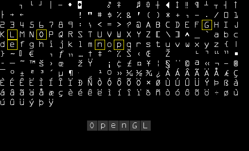
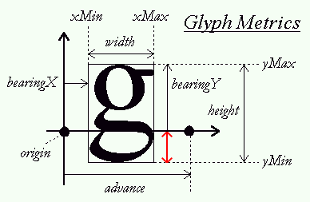

# 文本渲染

​		当你在图形计算领域冒险到了一定阶段以后你可能会想使用OpenGL来绘制文本。然而，可能与你想象的并不一样，使用像OpenGL这样的底层库来把文本渲染到屏幕上并不是一件简单的事情。如果你只需要绘制128种不同的字符(Character)，那么事情可能会简单一些。但是如果你要绘制的字符有着不同的宽、高和边距，事情马上就复杂了。根据你使用语言的不同，你可能会需要多于128个字符。再者，如果你要绘制音乐符、数学符号这些特殊的符号；或者渲染竖排文本呢？一旦你把文本这些复杂的情况考虑进来，你就不会奇怪为什么OpenGL这样的底层API没有包含文本处理了。

​		由于**OpenGL本身并没有包含任何的文本处理能力，我们必须自己定义一套全新的系统让OpenGL绘制文本到屏幕上**。由于文本字符没有图元，我们必须要有点创造力才行。需要使用的一些技术可以是：**通过GL_LINES来绘制字形，创建文本的3D网格(Mesh)，或在3D环境中将字符纹理渲染到2D四边形上**。

> 也就是opengl不支持显示文字，只能够通过自己来使用GL_LINES绘制，创建属于文本的网格或者将字符纹理渲染到2D四边形

​		开发者**最常用的一种方式是将字符纹理绘制到四边形上**。绘制这些纹理四边形本身其实并不是很复杂，然而检索要绘制文本的纹理却变成了一项有挑战性的工作。本教程将探索多种文本渲染的实现方法，并且使用`FreeType`库实现一个更加高级但更灵活的渲染文本技术。

## 经典文本渲染：位图字体

​		早期的时候，渲染文本是通过选择一个需要的字体(Font)（或者自己创建一个），并提取这个字体中所有相关的字符，将它们**放到一个单独的大纹理**中来实现的。这样一张纹理叫做**位图字体**(Bitmap Font)，它**在纹理的预定义区域中包含了我们想要使用的所有字符**。字体的这些字符被称为**字形**(Glyph)。**每个字形都关联着一个特定的纹理坐标区域**。当你想要渲染一个字符的时候，你只需要**通过渲染这一块特定的位图字体区域到2D四边形上**即可。



​		你可以看到，我们取一张位图字体，（**通过仔细选择纹理坐标**）从纹理中采样对应的字形，并渲染它们到多个2D四边形上，最终渲染出“OpenGL”文本。通过启用混合，让背景保持透明，最终就能渲染一个字符串到屏幕上。这个位图字体是通过Codehead的位图[字体生成器](http://www.codehead.co.uk/cbfg/)生成的。

​		使用这种方式绘制文本有许多优势也有很多缺点。首先，它**相对来说很容易实现**，并且因为**位图字体已经预光栅化了**，它的效率也很高。然而，这种方式不够灵活。当你想要使用不同的字体时，你需要重新编译一套全新的位图字体，而且你的程序会被限制在一个固定的分辨率。如果你对这些文本进行缩放的话你会看到文本的像素边缘。此外，这种方式**通常会局限于非常小的字符集**，如果你想让它来支持Extended或者Unicode字符的话就很不现实了。

​		这种绘制文本的方式曾经得益于它的高速和可移植性而非常流行，然而现在已经出现更加灵活的方式了。其中一个是我们即将讨论的使用FreeType库来加载TrueType字体的方式。

## 现代文本渲染：FreeType

​		FreeType是一个能够用于加载字体并将他们渲染到位图以及提供多种字体相关的操作的软件开发库。它是一个非常受欢迎的跨平台字体库，它被用于Mac OS X、Java、PlayStation主机、Linux、Android等平台。FreeType的真正吸引力在于**它能够加载TrueType字体**。

​		TrueType字体不是用像素或其他不可缩放的方式来定义的，它是**通过数学公式（曲线的组合）来定义的**。类似于矢量图像，这些光栅化后的字体图像可以根据需要的字体高度来生成。通过使用TrueType字体，你可以**轻易渲染不同大小的字形而不造成任何质量损失**。

​		在使用FreeType的时候需要确保导入合适的头文件:

```c++
#include <ft2build.h>
#include FT_FREETYPE_H
```

> ​		由于FreeType的开发方式，你不能将它们的头文件放到一个新的目录下。它们应该保存在你include目录的根目录下。通过使用像 `#include <FreeType/ft2build.h>` 这样的方式导入FreeType可能会出现一些头文件冲突的问题

​		FreeType所做的事就是加载TrueType字体并**为每一个字形生成位图以及计算几个度量值(Metric)**。我们可以提取出它生成的位图作为字形的纹理，并使用这些度量值定位字符的字形。

​		要加载一个字体，我们只需要初始化FreeType库，并且将这个字体加载为一个FreeType称之为面(Face)的东西。这里为我们加载一个从**Windows/Fonts**目录中拷贝来的TrueType字体文件**arial.ttf**。

```
//初始化字体库
FT_Library ft;
if(FT_Init_FreeType(&ft)){
	std::cout << "ERROR::FREETYPE: Could not init FreeType Library" << std::endl;
}
//初始化面
FT_Face face;
if(FT_New_Face(ft, "./resources/font/arial.ttf", 0, &face)){
	std::cout << "ERROR::FREETYPE: Failed to load font" << std::endl;
}
```

​		这些FreeType函数在出现错误时将返回一个非零的整数值。

​		当面加载完成之后，我们需要定义字体大小，这表示着我们要从字体面中生成多大的字形：

```c++
//设置字体大小，宽度值设为0表示我们要从字体面通过给定的高度中动态计算出字形的宽度
FT_Set_Pixel_Sizes(face, 0, 48);
```

​		此函数设置了字体面的宽度和高度，将**宽度值设为0表示我们要从字体面通过给定的高度中动态计算出字形的宽度**。

​		**一个FreeType面中包含了一个字形的集合**。我们可以调用`FT_Load_Char`函数来将其中一个字形设置为激活字形。这里我们选择加载字符字形’X’：

```c++
//激活字形，使其被加载出来使用
//FT_LOAD_RENDER是设置的加载标记，可以通过这个告诉FreeType创建8位的灰度位图，再通过face->glyph->bitmap来查看
if(FT_Load_Char(face, 'X', FT_LOAD_RENDER)){
	std::cout << "ERROR::FREETYTPE: Failed to load Glyph" << std::endl;
}
```

​		通过将`FT_LOAD_RENDER`设为加载标记之一，我们告诉FreeType去创建一个8位的灰度位图，我们可以通过`face->glyph->bitmap`来访问这个位图。

​		使用FreeType加载的每个字形**没有相同的大小**（不像位图字体那样）。使用FreeType生成的位图的大小恰好能包含这个字符可见区域。例如生成用于表示      ’ .’的位图的大小要比表示’X’的小得多。因此，FreeType同样也**加载了一些度量值来指定每个字符的大小和位置**。下面这张图展示了FreeType对每一个字符字形计算的所有度量值。


​		**每一个字形都放在一个水平的基准线(Baseline)上**（即上图中水平箭头指示的那条线）。一些字形恰好位于基准线上（如’X’），而另一些则会稍微越过基准线以下（如’g’或’p’）（译注：即这些带有下伸部的字母，可以见[这里](https://www.supremo.tv/typeterms/)）。这些**度量值精确定义了摆放字形所需的每个字形距离基准线的偏移量，每个字形的大小，以及需要预留多少空间来渲染下一个字形**。下面这个表列出了我们需要的所有属性。

| 属性         | 获取方式                    | 生成位图描述                                                 |
| :----------- | :-------------------------- | :----------------------------------------------------------- |
| **width**    | `face->glyph->bitmap.width` | 位图宽度（像素）                                             |
| **height**   | `face->glyph->bitmap.rows`  | 位图高度（像素）                                             |
| **bearingX** | `face->glyph->bitmap_left`  | 水平距离，即位图相对于原点的水平位置（像素）                 |
| **bearingY** | `face->glyph->bitmap_top`   | 垂直距离，即位图相对于基准线的垂直位置（像素）               |
| **advance**  | `face->glyph->advance.x`    | 水平预留值，即原点到下一个字形原点的水平距离（单位：1/64像素） |

​		在需要渲染字符时，我们可以加载一个字符字形，获取它的度量值，并生成一个纹理，但每一帧都这样做会非常没有效率。我们应将这些生成的数据储存在程序的某一个地方，在需要渲染字符的时候再去调用。我们会定义一个非常方便的结构体，并将这些结构体存储在一个map中。

```c++
struct Character {
	//字形纹理ID
	unsigned int TextureID;
	//字形大小,width,height
	glm::ivec2 Size;
	//从基准线到字形左部/顶部的偏移值
	glm::ivec2 Bearing;
	//原点到下一个字形原点的距离
	unsigned int Advance;
};

std::map<char, Character> Characters;
```

​		这里只生成ASCII字符集的前128个字符。对每一个字符，我们生成一个纹理并保存相关数据至Character结构体中，之后再添加至Characters这个映射表中。这样子，渲染一个字符所需的所有数据就都被储存下来备用了。

```c++
//将字节对其限制禁用
glPixelStorei(GL_UNPACK_ALIGNMENT, 1);
for(GLubyte c = 0; c < 128; c++){
    if (FT_Load_Char(face, c, FT_LOAD_RENDER))
    {
        std::cout << "ERROR::FREETYTPE: Failed to load Glyph" << std::endl;
        continue;
    }
    // 生成纹理
    GLuint texture;
    glGenTextures(1, &texture);
    glBindTexture(GL_TEXTURE_2D, texture);
    glTexImage2D(
        GL_TEXTURE_2D,
        0,
        GL_RED,
        face->glyph->bitmap.width,
        face->glyph->bitmap.rows,
        0,
        GL_RED,
        GL_UNSIGNED_BYTE,
        face->glyph->bitmap.buffer
    );
    // 设置纹理选项
    glTexParameteri(GL_TEXTURE_2D, GL_TEXTURE_WRAP_S, GL_CLAMP_TO_EDGE);
    glTexParameteri(GL_TEXTURE_2D, GL_TEXTURE_WRAP_T, GL_CLAMP_TO_EDGE);
    glTexParameteri(GL_TEXTURE_2D, GL_TEXTURE_MIN_FILTER, GL_LINEAR);
    glTexParameteri(GL_TEXTURE_2D, GL_TEXTURE_MAG_FILTER, GL_LINEAR);
    // 储存字符供之后使用
    Character character = {
        texture, 
        glm::ivec2(face->glyph->bitmap.width, face->glyph->bitmap.rows),
        glm::ivec2(face->glyph->bitmap_left, face->glyph->bitmap_top),
        face->glyph->advance.x
    };
    Characters.insert(std::pair<GLchar, Character>(c, character));
}
```

​		在这个for循环中我们遍历了ASCII集中的全部128个字符，并获取它们对应的字符字形。对每一个字符，我们生成了一个纹理，设置了它的选项，并储存了它的度量值。有趣的是我们这里将纹理的`internalFormat`和`format`设置为**GL_RED**。**通过字形生成的位图是一个8位灰度图，它的每一个颜色都由一个字节来表示。因此我们需要将位图缓冲的每一字节都作为纹理的颜色值**。这是通过创建一个特殊的纹理实现的，**这个纹理的每一字节都对应着纹理颜色的红色分量（颜色向量的第一个字节）**。如果我们使用一个字节来表示纹理的颜色，我们需要注意OpenGL的一个限制：

```c++
glPixelStorei(GL_UNPACK_ALIGNMENT, 1);   
```

​		**OpenGL要求所有的纹理都是4字节对齐的**，即纹理的大小**永远是4字节的倍数**。通常这并不会出现什么问题，因为大部分纹理的宽度都为4的倍数并/或每像素使用4个字节，但是**现在我们每个像素只用了一个字节，它可以是任意的宽度。通过将纹理解压对齐参数设为1，这样才能确保不会有对齐问题**（它可能会造成段错误）。

​		当你处理完字形后不要忘记清理FreeType的资源。

```c++
FT_Done_Face(face);
FT_Done_FreeType(ft);
```

### 着色器

​		我们将使用下面的顶点着色器来渲染字形：

```glsl
#version 330 core
layout(location = 0) in vec4 vertex;
out vec2 TexCoords;

uniform mat4 projection;

void main(){
	gl_Position = projection * vec4(vertex.xy, 0.0, 1.0);
	TexCoords = vertex.zw;
}
```

​		我们**将位置和纹理纹理坐标的数据合起来存在一个vec4中**。这个顶点着色器将位置坐标与一个投影矩阵相乘，并将纹理坐标传递给片段着色器：

```glsl
#version 330 core
in vec2 TexCoords;
out vec4 FragColor;

uniform sampler2D text;
uniform vec3 texColor;

void main(){
	//因为我们采样生成的Texture最终是记录的是灰度图
	vec4 sampled = vec4(1.0, 1.0, 1.0, texture(text, TexCoords).r);
	color = vec4(textColor, 1.0) * sampled;
}
```

​		片段着色器有两个uniform变量：一个是单颜色通道的字形位图纹理，另一个是颜色uniform，它可以用来调整文本的最终颜色。**我们首先从位图纹理中采样颜色值，由于纹理数据中仅存储着红色分量，我们就采样纹理的r分量来作为取样的alpha值**。通过变换颜色的alpha值，最终的颜色在字形背景颜色上会是透明的，而在真正的字符像素上是不透明的。我们也**将RGB颜色与textColor这个uniform相乘，来变换文本颜色**。

​		启用混合，使文字能够显示出来

```c++
glEnable(GL_BLEND);
glBlendFunc(GL_SRC_ALPHA, GL_ONE_MINUS_SRC_ALPHA);
```

​		对于投影矩阵，我们将使用一个**正射投影矩阵(Orthographic Projection Matrix)**。对于文本渲染我们（通常）都不需要透视，使用正射投影同样允许我们在屏幕坐标系中设定所有的顶点坐标，如果我们使用如下方式配置：

```c++
//正交矩阵的设置
glm::mat4 projection = glm::ortho(0.0f, 800.0f, 0.0, 600.0f);
```

​		我们设置投影矩阵的底部参数为`0.0f`，并**将顶部参数设置为窗口的高度**。这样做的结果是我们**指定了y坐标的范围为屏幕底部(0.0f)至屏幕顶部(600.0f)。这意味着现在点(0.0, 0.0)对应左下角**（译注：而不再是窗口正中间）。

​		最后要做的事是创建一个VBO和VAO用来渲染四边形。现在我们在初始化VBO时分配足够的内存，这样我们可以在渲染字符的时候再来更新VBO的内存。

```c++
unsigned int textVao, textVbo;
glGenVertexArrays(1, &textVao);
glGenBuffers(1, &textVbo);
glBindVertexArray(textVao);
glBindBuffer(GL_ARRAY_BUFFER, textVbo);
glBufferData(GL_ARRAY_BUFFER, sizeof(GL_FLOAT) * 6 * 4, NULL, GL_DYNAMIC_DRAW);
glEnableVertexAttribArray(0);
glVertexAttribPointer(0, 4, GL_FLOAT, GL_FALSE, 4 * sizeof(GLfloat), 0);
glBindBuffer(GL_ARRAY_BUFFER, 0);
glBindVertexArray(0); 
```

​		每个2D四边形需要6个顶点，每个顶点又是由一个4float向量（译注：一个纹理坐标和一个顶点坐标）组成，因此我们将VBO的内存分配为6 * 4个float的大小。**由于我们会在绘制字符时经常更新VBO的内存，所以我们将内存类型设置为GL_DYNAMIC_DRAW**。

### 渲染一行文本

​		要渲染一个字符，我们从之前创建的Characters映射表中取出对应的Character结构体，并根据字符的度量值来计算四边形的维度。根据四边形的维度我们就能动态计算出6个描述四边形的顶点，并使用`glBufferSubData`函数更新VBO所管理内存的内容。

​		我们创建一个叫做`RenderText`的函数渲染一个字符串：

```c++
void RenderText(Shader &shader, std::string text, float x, float y, float scale, glm::vec3 color) {
    shader.use();
    shader.setVec3("textColor" , color);
    glActiveTexture(GL_TEXTURE0);
    glBindVertexArray(textVao);

    std::string::const_iterator c;
    for (c = text.begin; c != text.end(); c++) {
        Character ch = Characters[*c];
        //字符原点坐标
        float xpos = ch.Size.x * scale + x;
        //有一些字符在基准线之下的时候，字形四边形应该被摆放在RenderText的y值之下
        float ypos = y - (ch.Size.y - ch.Bearing.y) * scale;
		//字符的宽度和高度
        float w = ch.Size.x * scale;
        float h = ch.Size.y * scale;
        // 对每个字符更新VBO
        float vertices[6][4] = {
            { xpos,     ypos + h,   0.0, 0.0 },
            { xpos,     ypos,       0.0, 1.0 },
            { xpos + w, ypos,       1.0, 1.0 },

            { xpos,     ypos + h,   0.0, 0.0 },
            { xpos + w, ypos,       1.0, 1.0 },
            { xpos + w, ypos + h,   1.0, 0.0 }
        };
        // 在四边形上绘制字形纹理
        glBindTexture(GL_TEXTURE_2D, ch.TextureID);
        // 更新VBO内存的内容
        glBindBuffer(GL_ARRAY_BUFFER, textVbo);
        glBufferSubData(GL_ARRAY_BUFFER, 0, sizeof(vertices), vertices);
        glBindBuffer(GL_ARRAY_BUFFER, 0);
        // 绘制四边形
        glDrawArrays(GL_TRIANGLES, 0, 6);
        // 更新位置到下一个字形的原点，注意单位是1/64像素
        x += (ch.Advance >> 6) * scale; // 位偏移6个单位来获取单位为像素的值 (2^6 = 64)
    }
    glBindVertexArray(0);
    glBindTexture(GL_TEXTURE_2D, 0);
}
```

​		这个函数的内容应该非常明显了：我们首先计算出四边形的原点坐标（为xpos和ypos）和它的大小（为w和h），并生成6个顶点形成这个2D四边形；注意我们将每个度量值都使用scale进行缩放。接下来我们更新了VBO的内容、并渲染了这个四边形。

​		一些字符（如’p’或’q’）需要被渲染到基准线以下，因此字形四边形也应该被摆放在`RenderText`的y值以下。ypos的偏移量可以从字形的度量值中得出：



​		要计算这段距离，即偏移量，我们需要找出字形在基准线之下延展出去的距离。在上图中这段距离用红色箭头标出。从度量值中可以看到，我们可以**通过用字形的高度减去`bearingY`来计算这段向量的长度**。对于那些正好位于基准线上的字符（如’X’），这个值正好是0.0。而对于那些超出基准线的字符（如’g’或’j’），这个值则是正的。

​		如果你每件事都做对了，那么已经可以使用下面的语句成功渲染字符串了：

```c++
RenderText(shader, "This is sample text", 25.0f, 25.0f, 1.0f, glm::vec3(0.5, 0.8f, 0.2f));
RenderText(shader, "(C) LearnOpenGL.com", 540.0f, 570.0f, 0.5f, glm::vec3(0.3, 0.7f, 0.9f));
```

