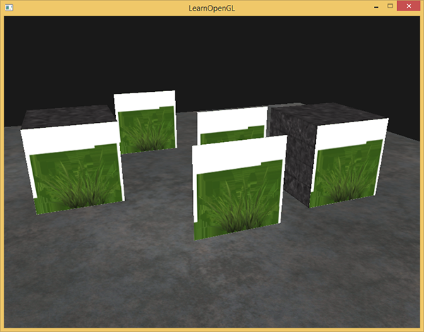

## 混合

​		**混合(Blending)通常是实现物体透明度(Transparency)的一种技术**。透明就是说一个物体（或者其中的一部分）不是纯色(Solid Color)的，它的颜色是物体本身的颜色和它背后其它物体的颜色的不同强度结合。**一个有色玻璃窗是一个透明的物体，玻璃有它自己的颜色，但它最终的颜色还包含了玻璃之后所有物体的颜色。**这也是混合这一名字的出处，我们混合(Blend)（不同物体的）多种颜色为一种颜色。所以透明度能让我们看穿物体。


​		**透明的物体可以是完全透明的（让所有的颜色穿过），或者是半透明的（它让颜色通过，同时也会显示自身的颜色）。一个物体的透明度是通过它颜色的aplha值来决定的。**Alpha颜色值是颜色向量的第四个分量，你可能已经看到过它很多遍了。在这个教程之前我们都将这个第四个分量设置为1.0，让这个物体的透明度为0.0，而当alpha值为0.0时物体将会是完全透明的。当alpha值为0.5时，物体的颜色有50%是来自物体自身的颜色，50%来自背后物体的颜色。

​		我们目前一直使用的纹理有三个颜色分量：红、绿、蓝。**但一些材质会有一个内嵌的alpha通道，对每个纹素(Texel)都包含了一个alpha值。**这个alpha值精确地告诉我们纹理各个部分的透明度。

### 丢弃片段

​		**有些图片并不需要半透明，只需要根据纹理颜色值，显示一部分，或者不显示一部分，没有中间情况**。比如说草，如果想不太费劲地创建草这种东西，你需要将一个草的纹理贴在一个2D四边形(Quad)上，然后将这个四边形放到场景中。然而，草的形状和2D四边形的形状并不完全相同，所以你**只想显示草纹理的某些部分，而忽略剩下的部分。**

​		下面这个纹理正是这样的，它要么是完全不透明的（alpha值为1.0），要么是完全透明的（alpha值为0.0），没有中间情况。你可以看到，只要不是草的部分，这个图片显示的都是网站的背景颜色而不是它本身的颜色。


​		

​		所以当添加像草这样的植被到场景中时，我们不希望看到草的方形图像，而是只显示草的部分，并能看透图像其余的部分。我们想要**丢弃(Discard)显示纹理中透明部分的片段，不将这些片段存储到颜色缓冲中**。在此之前，我们还要学习如何加载一个透明的纹理。

```c++
//stb_image在纹理有alpha通道的时候会自动加载，但我们仍要在纹理生成过程中告诉OpenGL，我们的纹理现在使用alpha通道了
glTexImage2D(GL_TEXTURE_2D, 0, GL_RGBA, width, height, 0, GL_RGBA, GL_UNSIGNED_BYTE, data);
```

```glsl
//全部4个颜色分量，而不仅仅是RGB分量(3个)
void main()
{
    FragColor = texture(texture1, TexCoords);
}
```

​		现在就在代码中实现小草的放置

```c++
//想多创建几个位置，用来放置小草，一个位置肯定不行的
vector<glm::vec3> vegetation;
vegetation.push_back(glm::vec3(-1.5f,  0.0f, -0.48f));
vegetation.push_back(glm::vec3( 1.5f,  0.0f,  0.51f));
vegetation.push_back(glm::vec3( 0.0f,  0.0f,  0.7f));
vegetation.push_back(glm::vec3(-0.3f,  0.0f, -2.3f));
vegetation.push_back(glm::vec3( 0.5f,  0.0f, -0.6f));
//在循环渲染中，将小草绘制出来
glBindVertexArray(vegetationVAO);
glBindTexture(GL_TEXTURE_2D, grassTexture);  
for(unsigned int i = 0; i < vegetation.size(); i++) 
{
    model = glm::mat4(1.0f);
    model = glm::translate(model, vegetation[i]);               
    shader.setMat4("model", model);
    glDrawArrays(GL_TRIANGLES, 0, 6);
}
```

运行程序你将看到：



​		出现这种情况是因为**OpenGL默认是不知道怎么处理alpha值的，更不知道什么时候应该丢弃片段**。我们需要自己手动来弄。幸运的是，有了着色器，这还是非常容易的。**GLSL给了我们`discard`命令，一旦被调用，它就会保证片段不会被进一步处理，所以就不会进入颜色缓冲。有了这个指令，我们就能够在片段着色器中检测一个片段的alpha值是否低于某个阈值，如果是的话，则丢弃这个片段，就好像它不存在一样**：

```glsl
#version 330 core
out vec4 FragColor;

in vec2 TexCoords;

uniform sampler2D texture1;

void main()
{             
    vec4 texColor = texture(texture1, TexCoords);
    if(texColor.a < 0.1)
        discard;
    FragColor = texColor;
}
```

​		我们检测被采样的纹理颜色的alpha值是否低于0.1的阈值，如果是的话，则丢弃这个片段。片段着色器保证了它只会渲染不是（几乎）完全透明的片段。现在它看起来就正常了：

<div style="border:2px solid #AFDFAF;background-color:#D8F5D8;padding:15px;margin:10px;border-radius:5px">注意，当采样纹理的边缘的时候，OpenGL会对边缘的值和纹理下一个重复的值进行插值（因为我们将它的环绕方式设置为了GL_REPEAT。这通常是没问题的，但是由于我们使用了透明值，纹理图像的顶部将会与底部边缘的纯色值进行插值。这样的结果是一个半透明的有色边框，你可能会看见它环绕着你的纹理四边形。要想避免这个，每当你alpha纹理的时候，请将纹理的环绕方式设置为GL_CLAMP_TO_EDGE：
<div style="border:1px solid #f2f3f4;background-color:#f5f7ff;padding:10px;margin:5px">
    <p>
        glTexParameteri( GL_TEXTURE_2D, GL_TEXTURE_WRAP_S, GL_CLAMP_TO_EDGE);
    </p>
<p>
    glTexParameteri( GL_TEXTURE_2D, GL_TEXTURE_WRAP_T, GL_CLAMP_TO_EDGE);
    </p>
    </div></div>
### 混合

虽然直接丢弃片段很好，但它不能让我们渲染半透明的图像。我们要么渲染一个片段，要么完全丢弃它。要想渲染有多个透明度级别的图像，我们**需要启用混合(Blending)**。和OpenGL大多数的功能一样，我们可以启用GL_BLEND来启用混合：

```c++
GL_ENABLE(GL_BLEND);
```

启用了混合之后，我们需要告诉OpenGL它该**如何**混合。

OpenGL中的混合是通过下面这个方程来实现的：
$$
\begin{equation}\bar{C}_{result} = \bar{\color{green}C}_{source} * \color{green}F_{source} + \bar{\color{red}C}_{destination} * \color{red}F_{destination}\end{equation}
$$

- $\bar{\color{green}C}_{source}$：源颜色向量。这是源自纹理的颜色向量。
- $\bar{\color{red}C}_{destination}$：目标颜色向量。这是当前储存在颜色缓冲中的颜色向量。
- $\color{green}F_{source}$：源因子值。指定了alpha值对源颜色的影响。
- $\color{red}F_{destination}$：目标因子值。指定了alpha值对目标颜色的影响。

​        片段着色器运行完成后，并且所有的测试都通过之后，这个混合方程(Blend Equation)才会应用到片段颜色输出与当前颜色缓冲中的值（当前片段之前储存的之前片段的颜色）上。源颜色和目标颜色将会由OpenGL自动设定，但源因子和目标因子的值可以由我们来决定。

例子：


​		我们有两个方形，我们希望将这个半透明的绿色方形绘制在红色方形之上。红色的方形将会是目标颜色（所以它应该先在颜色缓冲中），我们将要在这个红色方形之上绘制这个绿色方形。

​		问题来了：我们将因子值设置为什么？嘛，我们至少**想让绿色方形乘以它的alpha值，所以我们想要将$F_{src}$设置为源颜色向量的alpha值，也就是0.6。接下来就应该清楚了，目标方形的贡献应该为剩下的alpha值。如果绿色方形对最终颜色贡献了60%，那么红色方块应该对最终颜色贡献了40%**，即`1.0 - 0.6`。所以我们将$F_{destination}$设置为1减去源颜色向量的alpha值。这个方程变成了：
$$
\begin{equation}\bar{C}_{result} = \begin{pmatrix} \color{red}{0.0} \\ \color{green}{1.0} \\ \color{blue}{0.0} \\ \color{purple}{0.6} \end{pmatrix} * \color{green}{0.6} + \begin{pmatrix} \color{red}{1.0} \\ \color{green}{0.0} \\ \color{blue}{0.0} \\ \color{purple}{1.0} \end{pmatrix} * \color{red}{(1 - 0.6)} \end{equation}
$$
​		结果就是重叠方形的片段包含了一个60%绿色，40%红色的一种脏兮兮的颜色：


​		最终的颜色将会被储存到颜色缓冲中，替代之前的颜色。

​		这样子很不错，但我们该如何让OpenGL使用这样的因子呢？正好有一个专门的函数，叫做`glBlendFunc`。

​		`glBlendFunc(GLenum sfactor, GLenum dfactor)`函数接受两个参数，来设置源和目标因子。OpenGL为我们定义了很多个选项，我们将在下面列出大部分最常用的选项。注意常数颜色向量$\bar{\color{blue}C}_{constant}$可以通过`glBlendColor`函数来另外设置。

| 选项                          | 值                                                        |
| :---------------------------- | :-------------------------------------------------------- |
| `GL_ZERO`                     | 因子等于0                                                 |
| `GL_ONE`                      | 因子等于1                                                 |
| `GL_SRC_COLOR`                | 因子等于源颜色向量$\bar{\color{green}C}_{source}$         |
| `GL_ONE_MINUS_SRC_COLOR`      | 因子等于1−$\bar{\color{green}C}_{source}$                 |
| `GL_DST_COLOR`                | 因子等于目标颜色向量$\bar{\color{red}C}_{destination}$    |
| `GL_ONE_MINUS_DST_COLOR`      | 因子等于1−$\bar{\color{red}C}_{destination}$              |
| `GL_SRC_ALPHA`                | 因子等于$\bar{\color{green}C}_{source}$的$alpha$分量      |
| `GL_ONE_MINUS_SRC_ALPHA`      | 因子等于1−$\bar{\color{green}C}_{source}$的$alpha$分量    |
| `GL_DST_ALPHA`                | 因子等于$\bar{\color{red}C}_{destination}$的$alpha$分量   |
| `GL_ONE_MINUS_DST_ALPHA`      | 因子等于1−$\bar{\color{red}C}_{destination}$的$alpha$分量 |
| `GL_CONSTANT_COLOR`           | 因子等于常数颜色向量$\bar{\color{blue}C}_{constant}$      |
| `GL_ONE_MINUS_CONSTANT_COLOR` | 因子等于1−$\bar{\color{blue}C}_{constant}$                |
| `GL_CONSTANT_ALPHA`           | 因子等于$\bar{\color{blue}C}_{constant}$的$alpha$分量     |
| `GL_ONE_MINUS_CONSTANT_ALPHA` | 因子等于1−$\bar{\color{blue}C}_{constant}$的$alpha$分量   |

为了获得之前两个方形的混合结果，我们需要使用源颜色向量的$alpha$作为源因子，使用$1−alpha$作为目标因子。这将会产生以下的`glBlendFunc`：

```c++
glBlendFunc(GL_SRC_ALPHA, GL_ONE_MINUS_SRC_ALPHA);
```

还可以使用`glBlendFuncSeparate`为RGB和alpha通道分别设置不同的选项

```c++
glBlendFuncSeperate(GL_SRC_ALPHA, GL_ONE_MINUS_SRC_ALPHA, GL_ONE, GL_ZERO);
```

​		这个函数和我们之前设置的那样设置了RGB分量，但这样只能让最终的alpha分量被源颜色向量的alpha值所影响到。

​		OpenGL甚至给了我们更多的灵活性，允许我们改变方程中源和目标部分的运算符。当前源和目标是相加的，但如果愿意的话，我们也可以让它们相减。`glBlendEquation(GLenum mode)`允许我们设置运算符，它提供了三个选项：

- `GL_FUNC_ADD`：默认选项，将两个分量相加：$\bar{C}_{result} = \color{green}{Src} + \color{red}{Dst}$。
- `GL_FUNC_SUBTRACT`：将两个分量相减：$\bar{C}_{result} = \color{green}{Src} - \color{red}{Dst}$。
- `GL_FUNC_REVERSE_SUBTRACT`：将两个分量相减，但顺序相反：$\bar{C}_{result} = \color{red}{Dst} - \color{green}{Src}$。

### 渲染半透明纹理

代码实现如下:

```c++
glEnable(GL_BLEND);
glBlendFunc(GL_SRC_ALPHA, GL_ONE_MINUS_SRC_APLAH);
```

```glsl
//启用了混合，就不需要去丢弃片段了
#version 330 core
out vec4 FragColor;

in vec2 TexCoords;

uniform sampler2D texture1;

void main()
{             
    FragColor = texture(texture1, TexCoords);
}
```

​		现在（每当OpenGL渲染了一个片段时）它都会**将当前片段的颜色和当前颜色缓冲中的片段颜色根据alpha值来进行混合**。由于窗户纹理的玻璃部分是半透明的，我们应该能通窗户中看到背后的场景了。


​		但是这里存在一些问题，前面的窗户的透明部分遮蔽了背后的窗户。

​		发生这一现象的原因是，深度测试和混合一起使用的话会产生一些麻烦。当写入深度缓冲时，深度缓冲不会检查片段是否是透明的，所以透明的部分会和其它值一样写入到深度缓冲中。结果就是窗户的整个四边形不论透明度都会进行深度测试。即使透明的部分应该显示背后的窗户，深度测试仍然丢弃了它们。

​		所以我们不能随意地决定如何渲染窗户，让深度缓冲解决所有的问题了。这也是混合变得有些麻烦的部分。要想保证窗户中能够显示它们背后的窗户，我们需要首先绘制背后的这部分窗户。这也就是说在绘制的时候，我们必须先手动将窗户按照最远到最近来排序，再按照顺序渲染。

### 窗户绘制顺序

​		要想让混合在多个物体上工作，我们需要**最先绘制最远的物体，最后绘制最近的物体**。普通不需要混合的物体仍然可以使用深度缓冲正常绘制，所以它们不需要排序。但我们仍**要保证它们在绘制（排序的）透明物体之前已经绘制完毕了**。当绘制一个有不透明和透明物体的场景的时候，大体的原则如下：

1. 先绘制所有不透明的物体。
2. 对所有透明的物体排序。
3. 按顺序绘制所有透明的物体。

​        **排序透明物体的一种方法是，从*观察者视角*获取物体的距离**。这可以**通过计算摄像机位置向量和物体的位置向量之间的距离所获得**。接下来我们把距离和它对应的位置向量存储到一个STL库的map数据结构中。map会自动根据键值(Key)对它的值排序，所以只要我们添加了所有的位置，并以它的距离作为键，它们就会自动根据距离值排序了。

```c++
std::map<float, glm::vec3> sorted;
for (unsigned int i = 0; i < windows.size(); i++)
{
    float distance = glm::length(camera.Position - windows[i]);
    sorted[distance] = windows[i];
}

//在循环渲染中，通过迭代器去读取map中的数据然后进行绘制,r表示的是反向迭代器
for(std::map<float,glm::vec3>::reverse_iterator it = sorted.rbegin(); it != sorted.rend(); ++it) 
{
    model = glm::mat4();
    model = glm::translate(model, it->second);              
    shader.setMat4("model", model);
    glDrawArrays(GL_TRIANGLES, 0, 6);
}
```

<div style="border:1px solid #fff;background-color:red;margin:10px;padding:15px;border-radius:5px;color:#fff"><p>虽然按照距离排序物体这种方法对我们这个场景能够正常工作，但它并没有考虑旋转、缩放或者其它的变换，奇怪形状的物体需要一个不同的计量，而不是仅仅一个位置向量。</p><p>在场景中排序物体是一个很困难的技术，很大程度上由你场景的类型所决定，更别说它额外需要消耗的处理能力了。完整渲染一个包含不透明和透明物体的场景并不是那么容易。更高级的技术还有次序无关透明度(Order Independent Transparency, OIT)，但这超出本教程的范围了。现在，你还是必须要普通地混合你的物体，但如果你很小心，并且知道目前方法的限制的话，你仍然能够获得一个比较不错的混合实现。</p></div>

