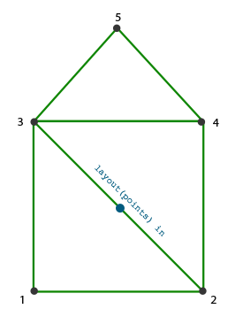
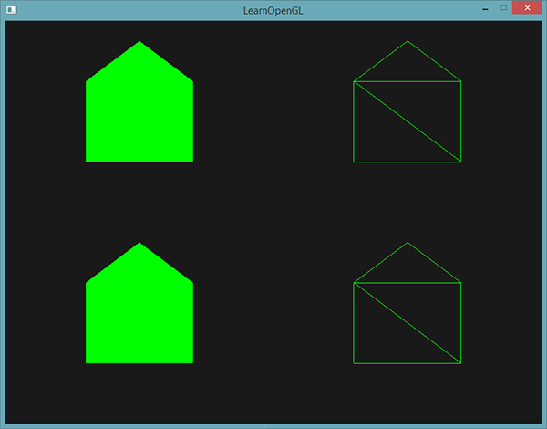

## 几何着色器

​		在顶点和片段着色器之间有一个**可选的几何着色器(Geometry Shader)**，**几何着色器的输入是一个图元（如点或三角形）的一组顶点**。几何着色器可以在顶点发送到下一着色器阶段之前对它们随意变换。然而，几何着色器最有趣的地方在于，**它能够将（这一组）顶点变换为完全不同的图元，并且还能生成比原来更多的顶点。**

```glsl
//几何着色器示例
#version 330 core
layout(points) in;
//输出线条，且最大顶点数据为2个，也就是输出一条线段
layout(line_strip, max_vertices = 2) out;

void main(){
	gl_Position = gl_in[0].gl_Position + vec4(-0.1, 0.0, 0.0, 0.0); 
    EmitVertex();

    gl_Position = gl_in[0].gl_Position + vec4( 0.1, 0.0, 0.0, 0.0);
    EmitVertex();

    EndPrimitive();
}
```

​		在几何着色器的顶部，我们**需要声明从顶点着色器输入的图元类型。这需要在in关键字前声明一个布局修饰符(Layout Qualifier)**。这个输入布局修饰符可以从顶点着色器接收下列任何一个图元值：

- `points`：绘制`GL_POINTS`图元时（1）。
- `lines`：绘制`GL_LINES`或`GL_LINE_STRIP`时（2）
- `lines_adjacency`：`GL_LINES_ADJACENCY`或`GL_LINE_STRIP_ADJACENCY`（4）
- `triangles`：`GL_TRIANGLES`、`GL_TRIANGLE_STRIP`或`GL_TRIANGLE_FAN`（3）
- `triangles_adjacency`：`GL_TRIANGLES_ADJACENCY`或`GL_TRIANGLE_STRIP_ADJACENCY`（6）

​		以上是能提供给`glDrawArrays`渲染函数的几乎所有图元了。如果我们想要将顶点绘制为`GL_TRIANGLES`，我们就要将输入修饰符设置为`triangles`。括号内的数字表示的是一个图元所包含的最小顶点数。

​		接下来，我们还需要指定几何着色器输出的图元类型，这需要在`out`关键字前面加一个布局修饰符。和输入布局修饰符一样，**输出布局修饰符也可以接受几个图元值：**

- **`points`**
- **`line_strip`**
- **`triangle_strip`**

​       有了这3个输出修饰符，我们就可以使用输入图元创建几乎任意的形状了。要生成一个三角形的话，我们将输出定义为`triangle_strip`，并输出3个顶点。

​		几何着色器同时希望我们设置一个它**最大能够输出的顶点数量**（如果你超过了这个值，OpenGL将不会绘制**多出的**顶点），这个也可以在out关键字的布局修饰符中设置。在这个例子中，我们将输出一个`line_strip`，并将最大顶点数设置为2个。

​		如果你不知道什么是线条(Line Strip)：**线条连接了一组点，形成一条连续的线，它最少要由两个点来组成。**在渲染函数中每多加一个点，就会在这个点与前一个点之间形成一条新的线。在下面这张图中，我们有5个顶点：	


​		如果使用的是上面定义的着色器，那么这将只能输出一条线段，因为最大顶点数等于2。

​		为了生成更有意义的结果，我们需要某种方式来获取前一着色器阶段的输出。`GLSL`提供给我们一个内建(Built-in)变量，在内部看起来（可能）是这样的：

```glsl
in gl_Vertex{
	vec4  gl_Position;
	float gl_PointSize;
	float gl_ClipDistance[];
} gl_in[];
```

​		这里，它被声明为一个接口块，它包含了几个很有意思的变量，其中最有趣的一个是**gl_Position，它是和顶点着色器输出非常相似的一个向量**。

​		要注意的是，**它被声明为一个数组，因为大多数的渲染图元包含多于1个的顶点**，而几何着色器的输入是一个图元的**所有**顶点。

​		有了之前顶点着色器阶段的顶点数据，我们就可以使用2个几何着色器函数，**`EmitVertex`和`EndPrimitive`，来生成新的数据了。**几何着色器希望你能够生成并输出至少一个定义为输出的图元。在我们的例子中，我们需要至少生成一个线条图元。

```glsl
void main(){
	gl_Position = gl_in[0].gl_Position + vec4(-0.1, 0.0, 0.0, 0.0);
	EmitVertex();
	
	gl_Position = gl_in[0].gl_Position + vec4(0.1, 0.0, 0.0, 0.0);
	EmitVertex();
	
	EndPrimitive()l
}
```

​		每次我们调用`EmitVertex`时，`gl_Position`中的向量会被**添加到图元中**来。当`EndPrimitive`被调用时，**所有发射出的(Emitted)顶点都会合成为指定的输出渲染图元**。在一个或多个`EmitVertex`调用之后重复调用`EndPrimitive`能够生成多个图元。在这个例子中，我们发射了两个顶点，它们从原始顶点位置平移了一段距离，之后调用了`EndPrimitive`，将这两个顶点合成为一个包含两个顶点的线条。

```c++
glDrawArrays(GL_POINTS, 0, 4);
//通过上面这个渲染函数来生成线条
```

### 使用几何着色器

```c++
//通过代码实现，来教会如何使用几何着色器
float points[] = {
    -0.5f,  0.5f, // 左上
     0.5f,  0.5f, // 右上
     0.5f, -0.5f, // 右下
    -0.5f, -0.5f  // 左下
};
```

```glsl
//顶点着色器
#verison 330 core
layout(location = 0) in vec2 aPos;

void main(){
	gl_Position = vec4(aPos.x, aPos.y, 0.0, 1.0);
}
```

```glsl
//片段着色器
#version 330 core
out vec4 FragColor

void main(){
	FragColor = vec4(0.0, 1.0, 0.0, 1.0);
}
```

```c++
//绘制这四个点
shader.use();
glBindVertexArray(VAO);
glDrawArrays(GL_POINTS, 0, 4);
```

```c++
//在着色器类中，需要修改部分代码，使得几何着色器可以被使用
geometryShader = glCreateShader(GL_GEOMETRY_SHADER);
glShaderSource(geometryShader, 1, &gShaderCode, NULL);
glCompileShader(geometryShader);  
...
glAttachShader(program, geometryShader);
glLinkProgram(program);
```

#### 用几何着色器造房子

​		OpenGL中，**三角形带(Triangle Strip)是绘制三角形更高效的方式，它使用顶点更少。在第一个三角形绘制完之后，每个后续顶点将会在上一个三角形边上生成另一个三角形：每3个临近的顶点将会形成一个三角形。**如果我们一共有6个构成三角形带的顶点，那么我们会得到这些三角形：(1, 2, 3)、(2, 3, 4)、(3, 4, 5)和(4, 5, 6)，共形成4个三角形。**一个三角形带至少需要3个顶点，并会生成N-2个三角形。**使用6个顶点，我们创建了6-2 = 4个三角形。下面这幅图展示了这点：


​		通过使用三角形带作为几何着色器的输出，我们可以很容易创建出需要的房子形状，只需要以正确的顺序生成3个相连的三角形就行了。下面这幅图展示了顶点绘制的顺序，蓝点代表的是输入点：



```glsl
//几何着色器中实现
#version 330 core
layout(points) in;
layout(triangle_strip, max_vertices = 5) out;

void build_house(vec4 position){
    gl_Position = position + vec4(-0.2, -0.2,0.0, 0.0);
    EmitVertex();
    gl_Position = position + vec4(-0.2, 0.2,0.0, 0.0);
    EmitVertex();
    gl_Position = position + vec4(0.2, 0.2,0.0, 0.0);
    EmitVertex();
    gl_Position = position + vec4(0.2, -0.2,0.0, 0.0);
    EmitVertex();
    gl_Position = position + vec4(0.0, 0.4,0.0, 0.0);
    EmitVertex();
    
    EndPrimitive();
}

void main(){
    build_house(gl_in[0].gl_Position);
}
```

​		这个几何着色器生成了5个顶点，每个顶点都是原始点的位置加上一个偏移量，来组成一个大的三角形带。最终的图元会被光栅化，然后片段着色器会处理整个三角形带，最终在每个绘制的点处生成一个绿色房子：



​		每个房子实际上是由3个三角形组成的——全部都是使用空间中一点来绘制的。再给每个房子分配一个不同的颜色。为了实现这个，**需要在顶点着色器中添加一个额外的顶点属性，表示颜色信息，将它传递至几何着色器，并再次发送到片段着色器中。**

```c++
//更新后的顶点数据
float points[] = {
    -0.5f,  0.5f, 1.0f, 0.0f, 0.0f, // 左上
     0.5f,  0.5f, 0.0f, 1.0f, 0.0f, // 右上
     0.5f, -0.5f, 0.0f, 0.0f, 1.0f, // 右下
    -0.5f, -0.5f, 1.0f, 1.0f, 0.0f  // 左下
};
```

```glsl
//更新顶点着色器
#version 330 core
layout(location = 0) in vec2 aPos;
layout(location = 1) in vec3 aColor;

out VS_OUT {
	vec3 color;
} vs_out;

void main(){
	gl_Position = vec4(aPos.x, aPos.y, 0.0, 1.0);
	vs_out.color = aColor;
}
```

```glsl
//在几何着色器中去接这个接口块
in VS_OUT{
	vec3 color;
}gs_in[];
//因为几何着色器是作用于输入的一组顶点的，从顶点着色器发来输入数据总是会以数组的形式表示出来，即便我们现在只有一个顶点。
```

我们并不是必须要用接口块来向几何着色器传递数据。如果顶点着色器发送的颜色向量是`out vec3 vColor`，我们也可以这样写：

```
in vec3 vColor[];
```

然而，接口块在几何着色器这样的着色器中会更容易处理一点。实际上，几何着色器的输入能够变得非常大，将它们合并为一个大的接口块数组会更符合逻辑一点。

```glsl
//为下一个片段着色器阶段声明一个输出的颜色向量
out vec3 fColor;
```

​		因为**片段着色器只需要一个（插值的）颜色**，发送多个颜色并没有什么意义。所以，**`fColor`向量就不是一个数组，而是一个单独的向量**。当发射一个顶点的时候，每个顶点将会使用最后在`fColor`中储存的值，来用于片段着色器的运行。对我们的房子来说，我们只需要在第一个顶点发射之前，使用顶点着色器中的颜色填充`fColor`一次就可以了。

```glsl
fColor = gs_in[0].color; // gs_in[0] 因为只有一个输入顶点
gl_Position = position + vec4(-0.2, -0.2, 0.0, 0.0);    // 1:左下  
EmitVertex();   
gl_Position = position + vec4( 0.2, -0.2, 0.0, 0.0);    // 2:右下
EmitVertex();
gl_Position = position + vec4(-0.2,  0.2, 0.0, 0.0);    // 3:左上
EmitVertex();
gl_Position = position + vec4( 0.2,  0.2, 0.0, 0.0);    // 4:右上
EmitVertex();
gl_Position = position + vec4( 0.0,  0.4, 0.0, 0.0);    // 5:顶部
EmitVertex();
EndPrimitive();  
```

### 物体爆破 

​		当我们说**爆破**一个物体时，我们**并不是指要将宝贵的顶点集给炸掉**，我们是要**将每个三角形沿着法向量的方向移动一小段时间**。效果就是，整个物体看起来像是沿着每个三角形的法线向量**爆炸**一样。爆炸三角形的效果在纳米装模型上看起来像是这样的：


​		因为我们想要沿着三角形的法向量位移每个顶点，我们**首先需要计算这个法向量。**我们所要做的是计算垂直于三角形表面的向量，仅使用我们能够访问的3个顶点。我们**使用叉乘来获取垂直于其它两个向量的一个向量**。如果我们能够获取两个平行于三角形表面的向量a和b，我们就能够对这两个向量进行叉乘来获取法向量了。下面这个几何着色器函数做的正是这个，来使用3个输入顶点坐标来获取法向量：

```glsl
vec3 GetNormal()
{
   vec3 a = vec3(gl_in[0].gl_Position) - vec3(gl_in[1].gl_Position);
   vec3 b = vec3(gl_in[2].gl_Position) - vec3(gl_in[1].gl_Position);
   return normalize(cross(a, b));
}
```

​		这里我们**使用减法获取了两个平行于三角形表面的向量a和b。因为两个向量相减能够得到这两个向量之间的差值**，并且三个点都位于三角平面上，对任意两个向量相减都能够得到一个平行于平面的向量。注意，**如果我们交换了cross函数中a和b的位置，我们会得到一个指向相反方向的法向量**——这里的顺序很重要！

​		既然知道了如何计算法向量了，我们就能够创建一个explode函数了，它使用法向量和顶点位置向量作为参数。这个函数会返回一个新的向量，它是位置向量沿着法线向量进行位移之后的结果：

```glsl
vec4 explode(vec4 position, vec3 normal)
{
    float magnitude = 2.0;
    vec3 direction = normal * ((sin(time) + 1.0) / 2.0) * magnitude; 
    return position + vec4(direction, 0.0);
}
```

​		函数本身应该不是非常复杂。**sin函数接收一个time参数，它根据时间返回一个-1.0到1.0之间的值**。因为我们不想让物体**向内爆炸**(Implode)，我们将sin值变换到了[0, 1]的范围内。最终的结果会乘以normal向量，并且最终的direction向量会被加到位置向量上。

```
#version 330 core
layout(points) in;
layout(triangle_strip, max_vertices = 3) out;

in VS_OUT {
	vec2 texCoords;
} gs_in[];

out vec2 TexCoords;

uniform float time;
vec4 explode(vec4 Position, vec3 normal){
	float magnitude = 2.0;
	vec3 direction = normal * ((sin(time) + 1.0)/ 2.0) * magnitude;
	return Position + vec4(direction, 0.0);
}
vec3 getNormal(){
	vec3 a = vec3(gl_in[0].gl_Position) - vec3(gl_in[1].gl_Position);
   	vec3 b = vec3(gl_in[2].gl_Position) - vec3(gl_in[1].gl_Position);
   	return normalize(cross(a, b));
}

void main(){
	vec3 normal = getNormal();
	gl_Position = explode(gl_in[0].gl_Position, normal);
	TexCoords = gs_in[0].texCoords;
	EmitVertex();
	gl_Position = explode(gl_in[1].gl_Position, normal);
	TexCoords = gs_in[1].texCoords;
	EmitVertex();
	gl_Position = explode(gl_in[2].gl_Position, normal);
	TexCoords = gs_in[2].texCoords;
	EmitVertex();
	EndPrimitive();
}
```

### 法向量可视化

​		当编写光照着色器时，你可能会最终会得到一些奇怪的视觉输出，但又很难确定导致问题的原因。**光照错误很常见的原因就是法向量错误**，这可能是由于不正确加载顶点数据、**错误地将它们定义为顶点属性或在着色器中不正确地管理所导致的**。我们想要的是使用某种方式来检测提供的法向量是正确的。检测法向量是否正确的一个很好的方式就是对它们进行可视化，几何着色器正是实现这一目的非常有用的工具。

​		实现思路：先绘制出场景，再通过几何着色器二次绘制场景，但是第二次绘制的场景不显示，只显示产生的法向量。

```c++
//伪代码
shader.use();
DrawScene();
normalDisplayShader.use();
DrawScene();
```

​		这次在几何着色器中，**我们会使用模型提供的顶点法线**，而不是自己生成，**为了适配（观察和模型矩阵的）缩放和旋转，我们在将法线变换到裁剪空间坐标之前，先使用法线矩阵变换一次**（几何着色器**接受的位置向量是剪裁空间坐标，所以我们应该将法向量变换到相同的空间**中）。这可以在顶点着色器中完成：

```glsl
#version 330 core
layout(location = 0) in vec3 aPos;
layout(location = 2) in vec2 aTexCoords;

out VS_OUT{
	vec3 normal;
}vs_out;

uniform mat4 model;
uniform mat4 view;
uniform mat4 projection;

void main(){
	gl_Position = projection * view * model * vec4(aPos, 1.0);
    //几何着色器接受的位置向量是剪裁空间坐标，所以我们应该将法向量变换到相同的空间中
	mar3 normalMatrix = mat3(transpose(inverse(view * model)));
	vs_out.normal = normalize(vec3(projection * vec4(normalMatrix * aNormal, 0.0)));
}
```

​		变换后的裁剪空间法向量会以接口块的形式传递到下个着色器阶段。接下来，几何着色器会接收每一个顶点（包括一个位置向量和一个法向量），并在每个位置向量处绘制一个法线向量：

```glsl
#version 330 core
layout (triangles) in;
layout (line_strip, max_vertices = 6) out;

in VS_OUT {
    vec3 normal;
} gs_in[];

const float MAGNITUDE = 0.4;

void GenerateLine(int index)
{
    gl_Position = gl_in[index].gl_Position;
    EmitVertex();
    gl_Position = gl_in[index].gl_Position + vec4(gs_in[index].normal, 0.0) * MAGNITUDE;
    EmitVertex();
    EndPrimitive();
}

void main()
{
    GenerateLine(0); // 第一个顶点法线
    GenerateLine(1); // 第二个顶点法线
    GenerateLine(2); // 第三个顶点法线
}
```

