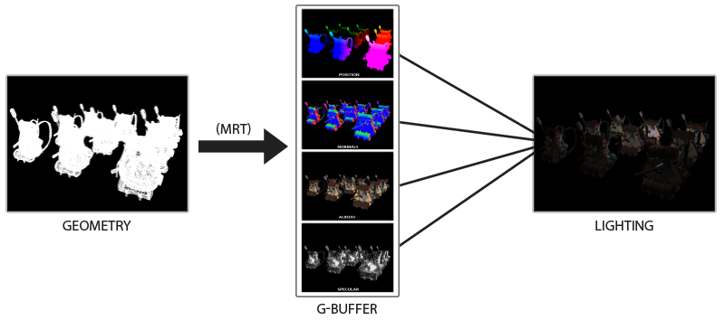

# 延迟着色法

​		我们现在一直使用的光照方式叫做**正向渲染(Forward Rendering)**或者**正向着色法(Forward Shading)**，它是我们渲染物体的一种非常直接的方式，在场景中我们根据所有光源照亮一个物体，之后再渲染下一个物体，以此类推。它非常容易理解，也很容易实现，但是同时它对程序性能的影响也很大，因为对于每一个需要渲染的物体，程序都要对每一个光源每一个需要渲染的片段进行迭代，这是**非常**多的！因为大部分片段着色器的输出都会被之后的输出覆盖，**正向渲染还会在场景中因为高深的复杂度(多个物体重合在一个像素上)浪费大量的片段着色器运行时间**。

​		**延迟着色法(Deferred Shading)**，**或者说是延迟渲染(Deferred Rendering)**，为了解决上述问题而诞生了，它大幅度地改变了我们渲染物体的方式。这给我们优化拥有大量光源的场景提供了很多的选择，因为它能够在渲染上百甚至上千光源的同时还能够保持能让人接受的帧率。下面这张图片包含了一共1874个点光源，它是使用延迟着色法来完成的，而这对于正向渲染几乎是不可能的。


​		延迟着色法基于我们**延迟(Defer)**或**推迟(Postpone)**大部分计算量非常大的渲染(像是光照)到后期进行处理的想法。它包含两个处理阶段(Pass)：在第一个几何处理阶段(Geometry Pass)中，我们**先渲染场景一次**，之后**获取对象的各种几何信息**，并**储存在一系列叫做G缓冲(G-buffer)的纹理中**；比如位置向量、颜色向量、法向量和镜面值。场景中这些储存在G缓冲中的几何信息将会在之后用来做(更复杂的)光照计算。下面是一帧中G缓冲的内容：

.png)

​		我们会在第二个光照处理阶段(Lighting Pass)中使用G缓冲内的纹理数据。在光照处理阶段中，我们**渲染一个屏幕大小的方形**，并**使用G缓冲中的几何数据**对每一个片段**计算场景的光照**；在**每个像素中都会对G缓冲进行迭代**。我们对于渲染过程进行解耦，将它高级的片段处理挪到后期进行，而不是直接将每个对象从顶点着色器带到片段着色器。光照计算过程还是和我们以前一样，但是现在我们需要**从对应的G缓冲而不是顶点着色器(和一些uniform变量)那里获取输入变量了**。

> ​		G缓冲中存储了几何体的相关参数，所以我们只会在顶点着色器中去构建几何体的位置和顶点，而其它相关的信息全部存在了G缓冲中了，将数据不在放在着色器中去读取而是选择放在了帧缓冲数据中去了。
>
> ​	然后阶段也就分为两个：
>
> 	1. 相关数据存入G缓冲中
>
>  	2. 从G缓冲中读取数据进行光照处理计算

​		下面这幅图片很好地展示了延迟着色法的整个过程：



​		这种渲染方法一个很大的好处就是能**保证在G缓冲中的片段和在屏幕上呈现的像素所包含的片段信息是一样的**，因为深度测试已经将这里的片段信息作为最新、最顶层的片段。这样保证了对于在光照处理阶段中处理的每一个像素都只处理一次，所以我们能够省下很多无用的渲染调用。除此之外，延迟渲染还允许我们做更多的优化，从而渲染更多的光源。

​		当然这种方法也带来几个缺陷， 由于G缓冲要求我们在纹理颜色缓冲中存储相对比较大的场景数据，这会消耗比较多的显存，尤其是类似位置向量之类的需要高精度的场景数据。 另外一个缺点就是他**不支持混色(因为我们只有最前面的片段信息)**， 因此也不能使用MSAA了。针对这几个问题我们可以做一些变通来克服这些缺点。

​		在几何处理阶段中填充G缓冲非常高效，因为我们直接储存像素位置，颜色或者是法线等对象信息到帧缓冲中，而这几乎不会消耗处理时间。在此基础上使用**多渲染目标(Multiple Render Targets, MRT)技术**，我们甚至可以在一个渲染处理之内完成这所有的工作。

## G-buffer

​		G缓冲(G-buffer)是对所有用来储存光照相关的数据，并在最后的光照处理阶段中使用的所有纹理的总称。趁此机会，让我们顺便复习一下在正向渲染中照亮一个片段所需要的所有数据：

- 一个3D**位置**向量来计算(插值)片段位置变量供`lightDir`和`viewDir`使用(TBN矩阵)
- 一个RGB漫反射**颜色**向量，也就是反照率(Albedo), diffuse
- 一个3D**法**向量来判断平面的斜率, Normal
- 一个镜面强度(Specular Intensity)浮点值, spec
- 所有光源的位置和颜色向量, lightDir、lightColor
- 观察者的位置向量, viewDir

​		有了这些(逐片段)变量的处置权，我们就能够计算我们很熟悉的(布林-)冯氏光照了。光源的位置，颜色，和观察者的观察位置可以通过uniform变量来设置，但是其它变量对于每个对象的片段都是不同的。如果我们能**以某种方式传输完全相同的数据到最终的延迟光照处理阶段中，我们就能计算与之前相同的光照效果了**，尽管我们只是在渲染一个2D方形的片段。

> lightPos、viewPos、lightColor还是需要我们自己去进行设置的，并且是在着色器中设置

​		OpenGL并没有限制我们能在纹理中能存储的东西，所以现在你应该清楚在一个或多个屏幕大小的纹理中储存所有逐片段数据并在之后光照处理阶段中使用的可行性了。因为**G缓冲纹理将会和光照处理阶段中的2D方形一样大，我们会获得和正向渲染设置完全一样的片段数据，但在光照处理阶段这里是一对一映射**。

​		整个过程在伪代码中会是这样的：

```c++
while(...) // 游戏循环
{
    // 1. 几何处理阶段：渲染所有的几何/颜色数据到G缓冲 
    glBindFramebuffer(GL_FRAMEBUFFER, gBuffer);
    glClear(GL_COLOR_BUFFER_BIT | GL_DEPTH_BUFFER_BIT);
    gBufferShader.Use();
    for(Object obj : Objects)
    {
        ConfigureShaderTransformsAndUniforms();
        obj.Draw();
    }  
    // 2. 光照处理阶段：使用G缓冲计算场景的光照
    glBindFramebuffer(GL_FRAMEBUFFER, 0);
    glClear(GL_COLOR_BUFFER_BIT);
    lightingPassShader.Use();
    BindAllGBufferTextures();
    SetLightingUniforms();
    RenderQuad();
}
```

​		对于每一个片段我们需要**储存的数据有：一个位置向量、一个法向量，一个颜色向量，一个镜面强度值**。所以我们在几何处理阶段中需要渲染场景中所有的对象并储存这些数据分量到G缓冲中。我们可以再次使用**多渲染目标(MRT)**来在一个渲染处理之内渲染多个颜色缓冲，在之前的泛光教程中我们也简单地提及了它。

​		对于几何渲染处理阶段，我们首先需要初始化一个帧缓冲对象，我们很直观的称它为`gBuffer`，它**包含了多个颜色缓冲和一个单独的深度渲染缓冲对象**(Depth Renderbuffer Object)。对于位置和法向量的纹理，我们希望使用高精度的纹理(每分量16或32位的浮点数)，而对于反射率和镜面值，使用默认的纹理( 8位精度的float即可)就够了。使用GL_RGBA16F而不是GL_RGB16F，因为**gpu通常更喜欢4组件格式而不是3组件格式**，因为有些驱动程序可能无法完成帧缓冲区。

```c++
unsigned int gBuffer;
glGenFrameBuffers(1, &gBuffer);
glBindFrameBuffer(GL_FRAMEBUFFER, gBuffer);
unsigned int gPosition, gNormal, gColorSpec;
//位置向量
glGenTextures(1, &gPosition);
glBindTexture(GL_TEXTURE_2D, gPosition);
glTexImage2D(GL_TEXTURE_2D, 0, GL_RGBA16F, SCR_WIDTH, SCR_HEIGHT, 0, GL_RGBA, GL_FLOAT, NULL);
glTexParameteri(GL_TEXTURE_2D, GL_TEXTURE_MIN_FILTER, GL_NEAREST);
glTexParameteri(GL_TEXTURE_2D, GL_TEXTURE_MAG_FILTER, GL_NEAREST);
glFramebufferTexture2D(GL_FRAMEBUFFER, GL_COLOR_ATTACHMENT0, GL_TEXTURE_2D, gPosition, 0);
  
//法线向量
glGenTextures(1, &gNormal);
glBindTexture(GL_TEXTURE_2D, gNormal);
glTexImage2D(GL_TEXTURE_2D, 0, GL_RGBA16F, SCR_WIDTH, SCR_HEIGHT, 0, GL_RGBA, GL_FLOAT, NULL);
glTexParameteri(GL_TEXTURE_2D, GL_TEXTURE_MIN_FILTER, GL_NEAREST);
glTexParameteri(GL_TEXTURE_2D, GL_TEXTURE_MAG_FILTER, GL_NEAREST);
glFramebufferTexture2D(GL_FRAMEBUFFER, GL_COLOR_ATTACHMENT1, GL_TEXTURE_2D, gNormal, 0);

//光照颜色+镜面强度
glGenTextures(1, &gAlbedoSpec);
glBindTexture(GL_TEXTURE_2D, gAlbedoSpec);
glTexImage2D(GL_TEXTURE_2D, 0, GL_RGBA, SCR_WIDTH, SCR_HEIGHT, 0, GL_RGBA, GL_UNSIGNED_BYTE, NULL);
glTexParameteri(GL_TEXTURE_2D, GL_TEXTURE_MIN_FILTER, GL_NEAREST);
glTexParameteri(GL_TEXTURE_2D, GL_TEXTURE_MAG_FILTER, GL_NEAREST);
glFramebufferTexture2D(GL_FRAMEBUFFER, GL_COLOR_ATTACHMENT2, GL_TEXTURE_2D, gAlbedoSpec, 0);
//告诉opengl，我们将要在渲染中使用的三个颜色缓冲
unsigned int attachments[3] = { GL_COLOR_ATTACHMENT0, GL_COLOR_ATTACHMENT1, GL_COLOR_ATTACHMENT2 };
glDrawBuffers(3, attachments);

// 之后同样添加渲染缓冲对象(Render Buffer Object)为深度缓冲(Depth Buffer)，并检查完整性
[...]
```

​		由于我们使用了多渲染目标，我们需要显式告诉OpenGL，我们需要使用`glDrawBuffers`渲染的是和`GBuffer`关联的哪个颜色缓冲。同样需要注意的是，我们使用RGBA纹理来储存位置和法线的数据，因为每个对象只有三个分量；但是我们**将颜色和镜面强度数据合并到一起，存储到一个单独的RGBA纹理里面，这样我们就不需要声明一个额外的颜色缓冲纹理了**。随着你的延迟渲染管线变得越来越复杂，需要更多的数据的时候，你就会很快发现新的方式来组合各个纹理中的数据。

​		接下来我们需要渲染它们到G缓冲中。假设每个对象都有漫反射，一个法线和一个镜面强度纹理，我们会想使用一些像下面这个片段着色器的东西来渲染它们到G缓冲中去。

```glsl
#version 330 core
layout(location = 0) out vec3 gPosition;
layout(location = 1) out vec3 gNormal;
layout(location = 2) out vec4 gAlbedoSpec;

in vec2 TexCoords;
in vec3 FragPos;
in vec3 Normal;

uniform sampler2D texture_diffuse1;
uniform sampler2D texture_specular1;

void main(){
    gPosition = FragPos;
    gNormal = normalize(Normal);
    gAlbedoSpec = texture(texture_diffuse1, TexCoords).rgb;
    gAlbeboSpec.a = texture(texture_specular1, TexCoords).r;
}
```

​		因为我们使用了多渲染目标，这个布局指示符(Layout Specifier)告诉了OpenGL我们需要渲染到当前的活跃帧缓冲中的哪一个颜色缓冲。注意我们并没有储存镜面强度到一个单独的颜色缓冲纹理中，因为**我们可以储存它单独的浮点值到其它颜色缓冲纹理的alpha分量中**。

> 请记住，因为有光照计算，所以保证所有变量在一个坐标空间当中至关重要。在这里我们在世界空间中存储(并计算)所有的变量。

​		如果我们现在想要渲染一大堆纳米装战士对象到`gBuffer`帧缓冲中，并通过一个一个分别投影它的颜色缓冲到铺屏四边形中尝试将他们显示出来，我们会看到向下面这样的东西：

.png)

​		尝试想象世界空间位置和法向量都是正确的。比如说，指向右侧的法向量将会被更多地对齐到红色上，从场景原点指向右侧的位置矢量也同样是这样。一旦你对G缓冲中的内容满意了，我们就该进入到下一步：光照处理阶段了。

## 延迟光照处理阶段

​		现在我们已经有了一大堆的片段数据储存在G缓冲中供我们处置，我们可以选择通过一个像素一个像素地遍历各个G缓冲纹理，并将储存在它们里面的内容作为光照算法的输入，来完全计算场景最终的光照颜色。由于所有的G缓冲纹理都代表的是最终变换的片段值，我们只需要对每一个像素**执行一次昂贵的光照运算**就行了。这使得延迟光照非常高效，特别是在需要调用大量重型片段着色器的复杂场景中。

​		对于这个光照处理阶段，我们将会渲染一个2D全屏的方形(有一点像后期处理效果)并且在每个像素上运行一个昂贵的光照片段着色器。

```c++
glClear(GL_COLOR_BUFFER_BIT | GL_DEPTH_BUFFER_BIT);
glActiveTexture(GL_TEXTURE0);
glBindTexture(GL_TEXTURE_2D, gPosition);
glActiveTexture(GL_TEXTURE1);
glBindTexture(GL_TEXTURE_2D, gNormal);
glActiveTexture(GL_TEXTURE2);
glBindTexture(GL_TEXTURE_2D, gAlbedoSpec);
// also send light relevant uniforms
shaderLightingPass.use();
SendAllLightUniformsToShader(shaderLightingPass);
shaderLightingPass.setVec3("viewPos", camera.Position);
RenderQuad();  
```

​		光照处理阶段的片段着色器和我们之前一直在用的光照教程着色器是非常相似的，除了我们添加了一个新的方法，从而使我们能够获取光照的输入变量，当然这些变量我们会从G缓冲中直接采样。

```glsl
#version 330 core
out vec4 FragColor;
in vec2 TexCoords;

uniform sampler2D gPosition;
uniform sampler2D gNormal;
uniform sampler2D gAlbedoSpec;

struct Light {
    vec3 Position;
    vec3 Color;
}

const int NR_LIGHTS = 32;
uniform Light lights[NR_LIGHTS];
uniform vec3 viewPos;

void main(){
    vec3 color = texture(gAlabedoSpec, TexCoords).rgb;
    vec3 FragPosition = texture(gPosition, TexCoords).rgb;
    vec3 Normal = texture(gNormal, TexCoords).rgb;
    vec3 viewDir = normalize(viewPos - FragPosition);
    float specular = texture(gAlabedoSpec, TexCoords).r;
    vec3 ambient = color * 0.1;
    vec3 lighting = ambient;
    for(int i = 0; i < NR_LIGHTS; ++i){
        vec3 lightDir = normalize(lights[i].Position - FragPosition);
        vec3 diffuse = max(dot(lightDir, Normal),0.0) * color;
        lighting += diffuse;
    }
    
    FragColor = vec4(lighting, 1.0f);
}
```

​		光照处理阶段着色器接受三个uniform纹理，代表G缓冲，它们包含了我们在几何处理阶段储存的所有数据。如果我们现在再使用当前片段的纹理坐标采样这些数据，我们将会获得和之前完全一样的片段值，这就像我们在直接渲染几何体。在片段着色器的一开始，我们通过一个简单的纹理查找从G缓冲纹理中获取了光照相关的变量。注意我们从`gAlbedoSpec`纹理中同时获取了`Albedo`颜色和`Spqcular`强度。

​		因为我们现在已经有了必要的逐片段变量(和相关的uniform变量)来计算布林-冯氏光照，我们不需要对光照代码做任何修改了。我们**在延迟着色法中唯一需要改的就是获取光照输入变量的方法**。

​		**延迟着色法的其中一个缺点就是它不能进行混合**，因为G缓冲中所有的数据都是从一个单独的片段中来的，而混合需要对多个片段的组合进行操作。延迟着色法另外一个缺点就是它迫使你对大部分场景的光照使用相同的光照算法，你可以通过包含更多关于材质的数据到G缓冲中来减轻这一缺点。

​		为了克服这些缺点(特别是混合)，我们通常**分割我们的渲染器为两个部分：一个是延迟渲染的部分，另一个是专门为了混合或者其他不适合延迟渲染管线的着色器效果而设计的的正向渲染的部分**。为了展示这是如何工作的，我们将会使用正向渲染器渲染光源为一个小立方体，因为光照立方体会需要一个特殊的着色器(会输出一个光照颜色)。

## 结合延迟渲染与正向渲染

​		现在我们想要渲染每一个光源为一个3D立方体，并放置在光源的位置上随着延迟渲染器一起发出光源的颜色。很明显，我们需要做的第一件事就是**在延迟渲染方形之上正向渲染所有的光源，它会在延迟渲染管线的最后进行**。所以我们只需要像正常情况下渲染立方体，只是会在我们完成延迟渲染操作之后进行。代码会像这样：

```c++
//正向渲染放在延迟渲染之后在进行渲染
[...]
RenderQuad();

shaderLightBox.use();
shaderLightBox.setMat4("projection", projection);
shaderLightBox.setMat4("view", view);
for (unsigned int i = 0; i < lightPositions.size(); i++)
{
    model = glm::mat4(1.0f);
    model = glm::translate(model, lightPositions[i]);
    model = glm::scale(model, glm::vec3(0.25f));
    shaderLightBox.setMat4("model", model);
    shaderLightBox.setVec3("lightColor", lightColors[i]);
    RenderCube();
}
```

​		然而，这些渲染出来的立方体并没有考虑到我们储存的延迟渲染器的几何深度(Depth)信息，并且结果是它被渲染在之前渲染过的物体之上。

​		我们需要做的就是首先**复制出在几何渲染阶段中储存的深度信息，并输出到默认的帧缓冲的深度缓冲**，然后我们才渲染光立方体。这样之后只有当它在之前渲染过的几何体上方的时候，光立方体的片段才会被渲染出来。我们可以**使用`glBlitFramebuffer`复制一个帧缓冲的内容到另一个帧缓冲中**。这个函数允许我们复制一个用户定义的帧缓冲区域到另一个用户定义的帧缓冲区域。

​		我们储存所有延迟渲染阶段中所有物体的深度信息在`gBuffer`这个FBO中。如果我们**仅仅是简单复制它的深度缓冲内容到默认帧缓冲的深度缓冲中，那么光立方体就会像是场景中所有的几何体都是正向渲染出来的一样渲染出来**。就像在抗锯齿教程中介绍的那样，我们需要指定一个帧缓冲为读帧缓冲，并且类似地指定一个帧缓冲为写帧缓冲：

```c++
//先去读取gBuffer这个帧缓冲的深度信息，然后将再去将读出来的深度缓冲内容赋值到默认帧缓冲中去。
glBindFramebuffer(GL_READ_FRAMEBUFFER, gBuffer);
glBindFramebuffer(GL_DRAW_FRAMEBUFFER, 0); // 写入到默认帧缓冲
glBlitFramebuffer(
  0, 0, SCR_WIDTH, SCR_HEIGHT, 0, 0, SCR_WIDTH, SCR_HEIGHT, GL_DEPTH_BUFFER_BIT, GL_NEAREST
);
glBindFramebuffer(GL_FRAMEBUFFER, 0);
// 现在像之前一样渲染光立方体
[...]  
```

​		在这里我们**复制整个读帧缓冲的深度缓冲信息到默认帧缓冲的深度缓冲**，对于颜色缓冲和模板缓冲我们也可以这样处理。现在如果我们接下来再渲染光立方体，场景里的几何体将会看起来很真实了，而不只是简单地粘贴立方体到2D方形之上。

## 更多的光源

​		延迟渲染一直被称赞的原因就是它能够渲染大量的光源而不消耗大量的性能。然而，**延迟渲染它本身并不能支持非常大量的光源，因为我们仍然必须要对场景中每一个光源计算每一个片段的光照分量**。真正让大量光源成为可能的是我们能够对延迟渲染管线引用的一个非常棒的优化：**光体积(Light Volumes)**

​		通常情况下，当我们渲染一个复杂光照场景下的片段着色器时，我们会计算场景中**每一个**光源的贡献，不管它们离这个片段有多远。很大一部分的光源根本就不会到达这个片段，所以为什么我们还要浪费这么多光照运算呢？

​		**隐藏在光体积背后的想法就是计算光源的半径，或是体积，也就是光能够到达片段的范围**。由于大部分光源都使用了某种形式的衰减(Attenuation)，我们可以用它来计算光源能够到达的最大路程，或者说是半径。我们接下来只需要对那些在一个或多个光体积内的片段进行繁重的光照运算就行了。这可以给我们省下来很可观的计算量，因为我们现在只在需要的情况下计算光照。

> 其实这里的光体积就是不需要再没每一像素上去进行计算了，只计算光照可以到达的最大像素位置，其他都不去计算，这样就可以节省计算量

​		这个方法的难点基本就是找出一个光源光体积的大小，或者是半径。

### 计算一个光源的体积或半径

​		为了获取一个光源的体积半径，我们需要解一个对于一个我们认为是**黑暗(Dark)**的亮度(Brightness)的衰减方程，它可以是0.0，或者是更亮一点的但仍被认为黑暗的值，像是0.03。为了展示我们如何计算光源的体积半径，我们将会使用一个在投光物这节中引入的一个更加复杂，但非常灵活的衰减方程：
$$
F_{light} = \frac{I}{K_c + K_l * d + K_q * d^2}
$$
​		我们现在想要在$F_{light}$等于0的前提下解这个方程，也就是说光在该距离完全是黑暗的。然而这个方程永远不会真正等于0.0，所以它没有解。所以，我们不会求表达式等于0.0时候的解，相反我们会**求当亮度值靠近于0.0的解**，**这时候它还是能被看做是黑暗的**。在这个教程的演示场景中，我们选择$5/256$作为一个合适的光照值；除以256是因为默认的8-bit帧缓冲可以每个分量显示这么多强度值(Intensity)。

<div style="border-radius:5px;margin:15px;padding:15px;border:2px solid #AFDFAF ;background-color:#D8F5D8">
我们使用的衰减方程在它的可视范围内基本都是黑暗的，所以如果我们想要限制它为一个比5/256更加黑暗的亮度，光体积就会变得太大从而变得低效。只要是用户不能在光体积边缘看到一个突兀的截断，这个参数就没事了。当然它还是依赖于场景的类型，一个高的亮度阀值会产生更小的光体积，从而获得更高的效率，然而它同样会产生一个很容易发现的副作用，那就是光会在光体积边界看起来突然断掉。
</div>

​		我们要求的衰减方程会是这样：
$$
\frac{5}{256} = \frac{I_{max}}{Attenuation}
$$
​		在这里，$I_{max}$是光源最亮的颜色分量。我们之所以使用光源最亮的颜色分量是因为解光源最亮的强度值方程最好地反映了理想光体积半径。
$$
\frac{5}{256} * Attenuation = I_{max}
$$

$$
Attenuation = I_{max} * \frac{256}{5}
$$

$$
K_q * d^2 + K_l * d + K_c - I_{max} * \frac{256}{5} = 0
$$

​		最后的方程形成了$ax^2 + bx + c = 0$的形式，我们可以用求根公式来解这个二次方程：
$$
x = \frac{-K_l + \sqrt{K_l^2 - 4 * K_q * (K_c - I_{max} * \frac{256}{5})}}{2 * K_q}
$$
​		它给我们了一个通用公式从而允许我们计算$x$的值，即光源的光体积半径，只要我们提供了一个常量，线性和二次项参数：

```c++
float constant  = 1.0; 
float linear    = 0.7;
float quadratic = 1.8;
float lightMax  = std::fmaxf(std::fmaxf(lightColor.r, lightColor.g), lightColor.b);
float radius    = 
  (-linear +  std::sqrtf(linear * linear - 4 * quadratic * (constant - (256.0 / 5.0) * lightMax))) 
  / (2 * quadratic);  
```

​		对于场景中每一个光源，我们都**计算它的半径，并仅在片段在光源的体积内部时才计算该光源的光照**。下面是更新过的光照处理阶段片段着色器，它考虑到了计算出来的光体积。注意这种方法仅仅用作教学目的，在实际场景中是不可行的，我们会在后面讨论它：

```glsl
struct Light {
    [...]
    float Radius;
}; 

void main()
{
    [...]
    for(int i = 0; i < NR_LIGHTS; ++i)
    {
        // 计算光源和该片段间距离
        float distance = length(lights[i].Position - FragPos);
        if(distance < lights[i].Radius)
        {
            // 执行大开销光照
            [...]
        }
    }   
}
```

​		这次的结果和之前一模一样，但是这次物体只对所在光体积的光源计算光照。

### 真正使用光体积

​		上面那个片段着色器在实际情况下不能真正地工作，它仅仅只演示了如何使用光体积减少光照运算。然而事实上，你的GPU和GLSL并不擅长优化循环和分支。这一缺陷的原因是GPU中着色器的运行是**高度并行**的，大部分的架构要求对于一个大的线程集合，GPU需要对它运行完全一样的着色器代码从而获得高效率。这通常意味着一个着色器运行时总是执行一个if语句**所有的**分支从而保证着色器运行都是一样的，这使得我们之前的**半径检测**优化完全变得无用，我们仍然在对所有光源计算光照！

​		使用光体积更好的方法是渲染一个实际的球体，并根据光体积的半径缩放。这些球的中心放置在光源的位置，由于它是根据光体积半径缩放的，这个球体正好覆盖了光的可视体积。这就是我们的技巧：我们**使用大体相同的延迟片段着色器来渲染球体**。因为球体产生了完全匹配于受影响像素的着色器调用，我们只渲染了受影响的像素而跳过其它的像素。下面这幅图展示了这一技巧：


>  这个技巧的实际就是用一个球体去模拟光照在各个方向上的最大覆盖区域体积，而且这个球体是使用延迟片段着色器去进行渲染的		

​		它被应用在场景中每个光源上，并且所得的片段相加混合在一起。这**个结果和之前场景是一样的，但这一次只渲染对于光源相关的片段。它有效地减少了从`nr_objects * nr_lights`到`nr_objects + nr_lights`的计算量，这使得多光源场景的渲染变得无比高效**。这正是为什么延迟渲染非常适合渲染很大数量光源。

​		然而这个方法仍然有一个问题：面剔除(Face Culling)需要被启用(否则我们会渲染一个光效果两次)，并且在它启用的时候用户可能进入一个光源的光体积，然而这样之后这个体积就不再被渲染了(由于背面剔除)，这会使得光源的影响消失。**这个问题可以通过一个模板缓冲技巧来解决**。

​		渲染光体积确实会带来沉重的性能负担，虽然它通常比普通的延迟渲染更快，这仍然不是最好的优化。另外两个基于延迟渲染的更流行(并且更高效)的拓展叫做**延迟光照(Deferred Lighting)**和**切片式延迟着色法(Tile-based Deferred Shading)**。这些方法会很大程度上提高大量光源渲染的效率，并且也能允许一个相对高效的多重采样抗锯齿(MSAA)。然而受制于这篇教程的长度，我将会在之后的教程中介绍这些优化。

## 延迟渲染 vs 正向渲染

​		仅仅是延迟着色法它本身(没有光体积)已经是一个很大的优化了，每个像素仅仅运行一个单独的片段着色器，然而对于正向渲染，我们通常会对一个像素运行多次片段着色器。当然，延**迟渲染确实带来一些缺点：大内存开销，没有MSAA和混合(仍需要正向渲染的配合)**。

​		当你有一个很小的场景并且没有很多的光源时候，延迟渲染并不一定会更快一点，甚至有些时候由于开销超过了它的优点还会更慢。**然而在一个更复杂的场景中，延迟渲染会快速变成一个重要的优化，特别是有了更先进的优化拓展的时候**。

​		最后我仍然想指出，**基本上所有能通过正向渲染完成的效果能够同样在延迟渲染场景中实现，这通常只需要很小的转换步骤**。举个例子，如果我们想要在延迟渲染器中使用法线贴图(Normal Mapping)，我们需要改变几何渲染阶段着色器来输出一个世界空间法线(World-space Normal)，它从法线贴图中提取出来(使用一个TBN矩阵)而不是表面法线，光照渲染阶段中的光照运算一点都不需要变。如果你想要让视差贴图工作，首先你需要在采样一个物体的漫反射，镜面，和法线纹理之前首先置换几何渲染阶段中的纹理坐标。一旦你了解了延迟渲染背后的理念，变得有创造力并不是什么难事。

