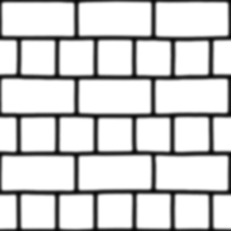

# 视差贴图

​		视差贴图(Parallax Mapping)技术和法线贴图差不多，但它有着不同的原则。和法线贴图一样，视差贴图能够极大提升表面细节，使之具有深度感。**它也是利用了视错觉，然而对深度有着更好的表达，与法线贴图一起用能够产生难以置信的效果**。**视差贴图和光照无关**，在这里是作为法线贴图的技术延续来讨论它的。需要注意的是在开始学习视差贴图之前强烈建议先对法线贴图，特别是切线空间有较好的理解。

​		**视差贴图属于位移贴图(Displacement Mapping)技术的一种**，它对根据储存在纹理中的几何信息**对顶点进行位移或偏移**。一种实现的方式是比如有1000个顶点，**根据纹理中的数据对平面特定区域的顶点的高度进行位移**。这样的**每个纹理像素包含了高度值纹理叫做高度贴图**。一张简单的砖块表面的高度贴图如下所示：

​		整个平面上的每个顶点都根据从高度贴图采样出来的高度值进行位移，根据材质的几何属性平坦的平面变换成凹凸不平的表面。例如一个平坦的平面利用上面的高度贴图进行置换能得到以下结果：

​		置换顶点有一个问题就是：**平面必须由很多顶点组成才能获得具有真实感的效果，否则看起来效果并不会很好**。一个平坦的表面上有1000个顶点计算量太大了。我们能否不用这么多的顶点就能取得相似的效果呢？事实上，上面的表面就是用6个顶点渲染出来的（两个三角形）。上面的那个表面使用视差贴图技术渲染，**位移贴图技术不需要额外的顶点数据来表达深度，它像法线贴图一样采用一种聪明的手段欺骗用户的眼睛**。

​		视差贴图背后的思想是**修改纹理坐标使一个fragment的表面看起来比实际的更高或者更低，所有这些都根据观察方向和高度贴图**。为了理解它如何工作，看看下面砖块表面的图片：

 		这里粗糙的红线代表高度贴图中的数值的立体表达，**向量$\color{orange}{\bar{V}}$代表观察方向**。如果平面进行实际位移，**观察者会在点$\color{blue}B$看到表面**。然而我们的平面实际上没有进行位移，观察方向将在点$\color{green}A$与平面接触。视差贴图的目的是，**在$\color{green}A$位置上的fragment不再使用点$\color{green}A$的纹理坐标而是使用点$\color{blue}B$的**。随后我们用点$\color{blue}B$的纹理坐标采样，观察者就像看到了点$\color{blue}B$一样。

​		这个技巧就是描述如何从点$\color{green}A$得到点$\color{blue}B$的纹理坐标。视差贴图尝试通过对从fragment到观察者的方向向量$\color{orange}{\bar{V}}$进行缩放的方式解决这个问题，**缩放的大小是$\color{green}A$处fragment的高度。所以我们将$\color{orange}{\bar{V}}$的长度缩放为高度贴图在点$\color{green}A$处$\color{green}{H(A)}$采样得来的值**。下图展示了经缩放得到的向量$\color{brown}{\bar{P}}$：

​		我们随后选出$\color{brown}{\bar{P}}$以及这个向量与平面对齐的坐标作为纹理坐标的偏移量。这能工作是因为**向量$\color{brown}{\bar{P}}$是使用从高度贴图得到的高度值计算出来的，所以一个fragment的高度越高位移的量越大**。

​		这个技巧在大多数时候都没问题，但点$\color{blue}B$是粗略估算得到的。**当表面的高度变化很快的时候，看起来就不会真实，因为向量$\color{brown}{\bar{P}}$最终不会和$\color{blue}B$接近**，就像下图这样：

​		视差贴图的另一个问题是，**当表面被任意旋转以后很难指出从$\color{brown}{\bar{P}}$获取哪一个坐标**。我们在视差贴图中使用了另一个坐标空间，**这个空间$\color{brown}{\bar{P}}$向量的x和y元素总是与纹理表面对齐。如果你看了法线贴图教程，你也许猜到了，我们实现它的方法，是的，我们还是在切线空间中实现视差贴图。**

​		将fragment到观察者的向量$\color{orange}{\bar{V}}$转换到切线空间中，经变换的$\color{brown}{\bar{P}}$向量的x和y元素将于表面的切线和副切线向量对齐。**由于切线和副切线向量与表面纹理坐标的方向相同，我们可以用$\color{brown}{\bar{P}}$的x和y元素作为纹理坐标的偏移量**，这样就不用考虑表面的方向了。

