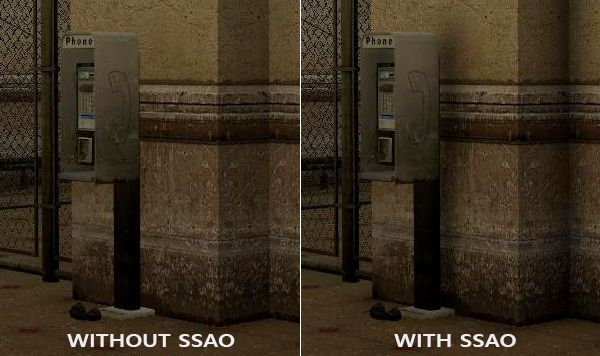
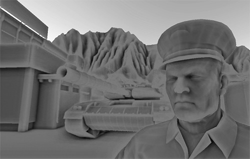

# SSAO

​		环境光照是我们加入场景总体光照中的一个固定光照常量，它被用来模拟光的**散射(Scattering)**。在现实中，光线会以任意方向散射，它的强度是会一直改变的，所以间接被照到的那部分场景也应该有变化的强度，而不是一成不变的环境光。其中一种间接光照的模拟叫做**环境光遮蔽(Ambient Occlusion)**，它的原理是通过将褶皱、孔洞和非常靠近的墙面变暗的方法近似模拟出间接光照。这些区域很大程度上是被周围的几何体遮蔽的，光线会很难流失，所以这些地方看起来会更暗一些。站起来看一看你房间的拐角或者是褶皱，是不是这些地方会看起来有一点暗？

​		下面这幅图展示了在使用和不使用SSAO时场景的不同。特别注意对比褶皱部分，你会发现(环境)光被遮蔽了许多：



​		尽管这不是一个非常明显的效果，启用SSAO的图像确实给我们更真实的感觉，这些小的遮蔽细节给整个场景带来了更强的深度感。

​		环境光遮蔽这一技术会带来很大的性能开销，因为它还需要考虑周围的几何体。我们可以对空间中每一点发射大量光线来确定其遮蔽量，但是这在实时运算中会很快变成大问题。在2007年，Crytek公司发布了一款叫做**屏幕空间环境光遮蔽(Screen-Space Ambient Occlusion, SSAO)**的技术，并用在了他们的看家作孤岛危机上。这一技术**使用了屏幕空间场景的深度而不是真实的几何体数据来确定遮蔽量**。这一做法相对于真正的环境光遮蔽不但速度快，而且还能获得很好的效果，使得它成为近似实时环境光遮蔽的标准。

​		SSAO背后的原理很简单：**对于铺屏四边形(Screen-filled Quad)上的每一个片段，我们都会根据周边深度值计算一个遮蔽因子(Occlusion Factor)。**这个遮蔽因子之后会被用来减少或者抵消片段的环境光照分量。**遮蔽因子是通过采集片段周围球型核心(Kernel)的多个深度样本，并和当前片段深度值对比而得到的**。高于片段深度值样本的个数就是我们想要的遮蔽因子。


​		上图中在几何体内灰色的深度样本都是高于片段深度值的，他们会增加遮蔽因子；**几何体内样本个数越多，片段获得的环境光照也就越少**。

​		很明显，**渲染效果的质量和精度与我们采样的样本数量有直接关系**。如果样本数量太低，渲染的精度会急剧减少，我们会得到一种叫做**波纹(Banding)**的效果；如果它太高了，反而会影响性能。我们可以通过**引入随机性到采样核心(Sample Kernel)的采样中从而减少样本的数目。通过随机旋转采样核心，我们能在有限样本数量中得到高质量的结果**。然而这仍然会有一定的麻烦，因为随机性引入了一个很明显的噪声图案，我们将需要通过模糊结果来修复这一问题。下面这幅图片展示了波纹效果还有随机性造成的效果：


​		你可以看到，尽管我们在低样本数的情况下得到了很明显的波纹效果，引入随机性之后这些波纹效果就完全消失了。

​		Crytek公司开发的SSAO技术会产生一种特殊的视觉风格。**因为使用的采样核心是一个球体，它导致平整的墙面也会显得灰蒙蒙的，因为核心中一半的样本都会在墙这个几何体上**。下面这幅图展示了孤岛危机的SSAO，它清晰地展示了这种灰蒙蒙的感觉：



​		由于这个原因，我们将**不会使用球体的采样核心，而使用一个沿着表面法向量的半球体采样核心**。


​		通过在**法向半球体(Normal-oriented Hemisphere)**周围采样，我们将不会考虑到片段底部的几何体.它消除了环境光遮蔽灰蒙蒙的感觉，从而产生更真实的结果。

## 样本缓冲

​		SSAO需要获取几何体的信息，因为我们需要一些方式来确定一个片段的遮蔽因子。对于每一个片段，我们将需要这些数据：

- 片段**位置**向量(FragPos)
- 片段的**法线**向量(Normal)
- 片段的**反射颜色**(diffuseTexture)
- **采样核心**
- 用来旋转采样核心的随机旋转矢量

​		通过使用一个片段观察空间位置，我们可以将一个采样半球核心对准片段的观察空间表面法线。对于**每一个核心样本我们会采样线性深度纹理来比较结果**。**采样核心会根据旋转矢量稍微偏转一点**；我们所获得的**遮蔽因子将会之后用来限制最终的环境光照分量**。


​		由于**SSAO是一种屏幕空间技巧**，我们对铺屏2D四边形上每一个片段计算这一效果；也就是说我们没有场景中几何体的信息。我们能做的只是渲染几何体数据到屏幕空间纹理中，我们之后再会将此数据发送到SSAO着色器中，之后我们就能访问到这些几何体数据了。你会发现这和延迟渲染很相似。这也就是说**SSAO和延迟渲染能完美地兼容，因为我们已经存位置和法线向量到GBuffer中了**。

​		由于我们已经有了片段位置和法线数据(G缓冲中)，我们只需要更新一下几何着色器，让它**包含片段的线性深度**（将裁剪空间的[0, 1]的深度值转换到相机空间的深度值[-1, 1]）就行了。回忆我们在深度测试那一节学过的知识，我们可以从`gl_FragCoord.z`中提取线性深度：

```glsl
#version 330 core
layout(location = 0) out vec4 gPositionDepth;
layout(location = 1) out vec4 gNormal;
layout(location = 2) out vec4 gAlabedoSpec;

in vec2 TexCoords;
in vec3 FragPos;
in vec3 Normal;

const float NEAR = 0.1;
const float FAR = 50.0;
float LinearizeDepth(float depth){
    //深度范围在[-1, 1]之间
    float z = depth * 2.0 - 1.0;
    return (2.0 * NEAR * FAR) / (FAR + NEAR - z * (FAR - NEAR));
}

void main(){
    gPositionDepth.xyz = FragPos;
    gPositionDepth.a = LinearizeDepth(gl_FragCoord.z);
    gNormal = normalize(Normal);
    gAlabedoSpec.rgb = vec3(0.95f);
}
```

​		提取出来的**线性深度是在观察空间中**的，所以**之后的运算也是在观察空间中**。确保**G缓冲中的位置和法线都在观察空间中**(乘上观察矩阵也一样)。观察空间线性深度值之后会被保存在`gPositionDepth`颜色缓冲的alpha分量中，省得我们再声明一个新的颜色缓冲纹理。

> ​		反转深度值的投影变换。这也就意味着我们需要首先将深度值从[0, 1]范围重新变换到[-1, 1]范围的标准化设备坐标（裁剪空间）。接下来我们需要像投影矩阵那样反转这个非线性方程，并将这个反转的方程应用到最终的深度值上。最终的结果就是一个线性的深度值了。
>
> ​		之前从观察空间到裁剪空间的时候，是先平移在旋转的，现在回到观察空间的话，就需要平移和旋转回原来的位置，但是这里只需要对z进行即可，因为我们只需要采集到观察空间中的深度信息

`gPositionDepth`颜色缓冲纹理被设置成了下面这样：

```c++
glGenTextures(1, &gPositionDepth);
glBindTexture(GL_TEXTURE_2D, gPositionDepth);
glTexImage2D(GL_TEXTURE_2D, 0, GL_RGBA16F, SCR_WIDTH, SCR_HEIGHT, 0, GL_RGBA, GL_FLOAT, NULL);
glTexParameteri(GL_TEXTURE_2D, GL_TEXTURE_MIN_FILTER, GL_NEAREST);
glTexParameteri(GL_TEXTURE_2D, GL_TEXTURE_MAG_FILTER, GL_NEAREST);
glTexParameteri(GL_TEXTURE_2D, GL_TEXTURE_WRAP_S, GL_CLAMP_TO_EDGE);
glTexParameteri(GL_TEXTURE_2D, GL_TEXTURE_WRAP_T, GL_CLAMP_TO_EDGE);
```

​		这给了我们一个线性深度纹理，我们可以**用它来对每一个核心样本获取深度值**。注意我们**把线性深度值存储为了浮点数据**；这样从0.1到50.0范围深度值都不会被限制在[0.0, 1.0]之间了。如果你不用浮点值存储这些深度数据，确保你首先将值除以`FAR`来标准化它们，再存储到`gPositionDepth`纹理中，并在以后的着色器中用相似的方法重建它们。同样需要注意的是`GL_CLAMP_TO_EDGE`的纹理封装方法。这保证了我们不会不小心采样到在屏幕空间中纹理默认坐标区域之外的深度值。

​		接下来我们需要真正的半球采样核心和一些方法来随机旋转它。


## 法向半球

​		我们需要沿着表面法线方向生成大量的样本。就像我们在这个教程的开始介绍的那样，我们想要**生成形成半球形的样本**。由于对每个表面法线方向生成采样核心非常困难，也不合实际，我们将**在切线空间(Tangent Space)内生成采样核心，法向量将指向正z方向**。


​		假设我们有一个单位半球，我们可以获得一个拥有最大64样本值的采样核心：

```c++
//在[0, 1]之中生成均匀分布的浮点数随机数
std::uniform_real_distribution<float> randomFloats(0.0, 1.0);
//随机数产生器
std::default_random_engine generator;
std::vector<glm::vec3> ssaoKernel;
for(int i = 0; i < 64; ++i){
    glm::vec3 sample (
    	randomFloats(generator) * 2.0 - 1.0,
        randomFloats(generator) * 2.0 - 1.0,
        randomFloats(generator)
    );
    sample = glm::normalize(sample);
    sample *= randomFloat(generator);
    float scale = float(i) / 64.0;
    
    ssaoKernel.push_back(sample);
}
```

​		我们**在切线空间中以-1.0到1.0为范围变换x和y方向，并以0.0和1.0为范围变换样本的z方向**$^1$。由于采样核心将会沿着表面法线对齐，所得的样本矢量将会在半球里。

> 这里的z是以[0, 1]范围来变换样本，是因为如果以-1.0到1.0为范围，取样核心就变成球型了。而我们在这里只需要半球，所以不需要变换到[-1, 1]范围中去。千万注意，这里取得采样核心全部都是在切线空间之中的，在着色器中需要转换成观察空间中去。

​		目前，所有的样本都是平均分布在采样核心里的，但是我们更愿意**将更多的注意放在靠近真正片段的遮蔽上**，也就是将核心样本靠近原点分布。我们可以用一个**加速插值函数**实现它：

```c++
   ...[接上函数]
   scale = lerp(0.1f, 1.0f, scale * scale);
   sample *= scale;
   ssaoKernel.push_back(sample);  
}

//加速插值函数
float lerp(float a, float b, float f){
    return a + f * (b-a);
}
```

​		这就给了我们一个大部分样本靠近原点的核心分布。


​		**每个核心样本将会被用来偏移观察空间片段位置从而采样周围的几何体。**我们在教程开始的时候看到，如果没有变化采样核心，我们将需要大量的样本来获得真实的结果。通过引入一个随机的转动到采样核心中，我们可以很大程度上减少这一数量。

## 随机核心转动

​		通过引入一些随机性到采样核心上，我们可以大大减少获得不错结果所需的样本数量。我们可以对场景中每一个片段创建一个随机旋转向量，但这会很快将内存耗尽。所以，更好的方法是**创建一个小的随机旋转向量纹理平铺在屏幕上**。

​		我们创建一个`4x4`**朝向切线空间平面法线**的随机旋转向量数组：

> 注意，这里创建的法线随即旋转向量数组是在切线空间之中的，而不是在观察空间中！

```c++
std::vector<glm::vec3> ssaoNoise;
for(int i = 0; i < 16; ++i){
	glm::vec3 noise(
		randomFloat(generator) * 2.0 - 1.0,
		randomFloat(generator) * 2.0 - 1.0,
		0.0f
	);
	ssaoNoise.push_back(noise);
}
```

​		**由于采样核心是沿着正z方向在切线空间内旋转，我们设定z分量为0.0，从而围绕z轴旋转。**

​		我们接下来创建一个包含随机旋转向量的`4x4`纹理；记得设定它的封装方法为`GL_REPEAT`，从而保证它合适地平铺在屏幕上。

```c++
unsigned int noiseTexture;
glGenTextures(1, noiseTexture);
glBindTexture(GL_TEXTURE_2D, noiseTexture);
glTexImage2D(GL_TEXTURE_2D, 0, GL_RGB16F, 4, 4, 0, GL_RGB, GL_FLOAT, &ssaoNoise[0]);
glTexParameteri(GL_TEXTURE_2D, GL_TEXTURE_MIN_FILTER, GL_NEAREST);
glTexParameteri(GL_TEXTURE_2D, GL_TEXTURE_MAG_FILTER, GL_NEAREST);
glTexParameteri(GL_TEXTURE_2D, GL_TEXTURE_WRAP_S, GL_REPEAT);
glTexParameteri(GL_TEXTURE_2D, GL_TEXTURE_WRAP_T, GL_REPEAT);
```

## SSAO着色器

​		**SSAO着色器在2D的铺屏四边形上运行**，它对于每一个生成的片段计算遮蔽值(为了在最终的光照着色器中使用)。由于我们需要存储SSAO阶段的结果，我们还需要在创建一个帧缓冲对象：

```c++
unsigned int ssaoFBO;
glGenFramebuffers(1, &ssaoFBO);
glBindFramebuffer(GL_FRAMEBUFFER, ssaoFBO);
unsigned int ssaoColorBuffer;
glGenTextures(1, &ssaoColorBuffer);
glBindTexture(GL_TEXTURE_2D, 0, GL_RED, SCR_WIDTH, SCR_HEIGHT, 0, GL_RGB, GL_FLOAT, NULL);
glTexParameteri(GL_TEXTURE_2D, GL_TEXTURE_MIN_FILTER, GL_NEAREST);
glTexParameteri(GL_TEXTURE_2D, GL_TEXTURE_MAG_FILTER, GL_NEAREST);
glFramebufferTexture2D(GL_FRAMEBUFFER, GL_COLOR_ATTACHMENT0, GL_TEXTURE_2D, ssaoColorBuffer, 0);
```

​		由于**环境遮蔽的结果是一个灰度值**，我们将**只需要纹理的红色分量**，所以我们将颜色缓冲的内部格式设置为`GL_RED`。

​		渲染SSAO完整的过程会像这样：

```c++
// 几何处理阶段: 渲染到G缓冲中
glBindFramebuffer(GL_FRAMEBUFFER, gBuffer);
    [...]
glBindFramebuffer(GL_FRAMEBUFFER, 0);  

// 使用G缓冲渲染SSAO纹理
glBindFramebuffer(GL_FRAMEBUFFER, ssaoFBO);
glClear(GL_COLOR_BUFFER_BIT);
shaderSSAO.Use();
glActiveTexture(GL_TEXTURE0);
glBindTexture(GL_TEXTURE_2D, gPositionDepth);
glActiveTexture(GL_TEXTURE1);
glBindTexture(GL_TEXTURE_2D, gNormal);
glActiveTexture(GL_TEXTURE2);
glBindTexture(GL_TEXTURE_2D, noiseTexture);
//构建核心采样点
SendKernelSamplesToShader();
shaderSSAO.setMat4("projection", projection);
RenderQuad();
glBindFramebuffer(GL_FRAMEBUFFER, 0);

// 光照处理阶段: 渲染场景光照
glClear(GL_COLOR_BUFFER_BIT | GL_DEPTH_BUFFER_BIT);
shaderLightingPass.Use();
[...]
glActiveTexture(GL_TEXTURE3);
glBindTexture(GL_TEXTURE_2D, ssaoColorBuffer);
[...]
RenderQuad();
```

`shaderSSAO`这个着色器将对应G缓冲纹理(包括线性深度)，噪声纹理和法向半球核心样本作为输入参数:

```glsl
#version 330 core
out vec4 FragColor;
in vec2 TexCoords;

uniform sampler2D gPositionDepth;
uniform sampler2D gNormal;
uniform sampler2D texNoise;

uniform vec3 samples[64];
uniform mat4 projection;

const vec2 noiseScale = vec2(800.0/4.0, 600.0/4.0);

void main(){
    [...]
}
```

​		注意我们这里有一个`noiseScale`的变量。我们想要将噪声纹理平铺(Tile)在屏幕上，但是由于`TexCoords`的取值在0.0和1.0之间，`texNoise`纹理将不会平铺。所以我们将通过屏幕分辨率除以噪声纹理大小的方式计算`TexCoords`的缩放大小，并在之后提取相关输入向量的时候使用。

> 噪声纹理的大小是4*4的，所以要是变换到铺满整个屏幕上的采样的话，就需要算出其缩放大小的向量，再乘到原来的纹理坐标上即可

```glsl
vec3 fragPos = texture(gPositionDepth, TexCoords).rgb;
vec3 normal = texture(gNormal, TexCoords).rgb;
vec3 randomVec = texture(texNoise, TexCoords * noiseScale).xyz;
```

​		由于我们将`texNoise`的平铺参数设置为`GL_REPEAT`，随机的值将会在全屏不断重复。加上`fragPog`和`normal`向量，我们就有足够的数据来创建一个TBN矩阵，**将向量从切线空间变换到观察空间。**

```glsl
vec3 tangent = normalize(randomVec - normal * dot(randomVec, normal));
vec3 bitangent = cross(normal, tangent);
mat3 TBN = mat3(tangent, bitangent, normal);
```

​		通过使用一个叫做Gramm-Schmidt处理(Gramm-Schmidt Process)的过程，我们创建了一个**正交基**(Orthogonal Basis)，每一次它都会根据`randomVec`的值稍微倾斜。注意**因为我们使用了一个随机向量来构造切线向量，我们没必要有一个恰好沿着几何体表面的TBN矩阵，也就是不需要逐顶点切线(和双切)向量**。

​		接下来我们对每个核心样本进行迭代，将**样本从切线空间变换到观察空间，将它们加到当前像素位置上，并将片段位置深度与储存在原始深度缓冲中的样本深度进行比较**。我们来一步步讨论它：

```glsl
float occlusion = 0.0;
//kernelSize采样核心点数量
for(int i = 0; i < kernelSize; ++i)
{
    // 获取样本位置，观察空间中的位置，原本的采样核心点是在切线空间中的
    vec3 sample = TBN * samples[i]; // 切线->观察空间
    //radius,法线半球体的半径大小，sample是采样核心的深度值
    sample = fragPos + sample * radius; 

    [...]
}
```

​		这里的`kernelSize`和`radius`变量都可以用来调整效果；在这里我们分别保持他们的默认值为`64`和`1.0`。对于每一次迭代我们**首先变换各自样本到观察空间**。之后我们会把观察空间核心偏移样本加到观察空间片段位置上；最后再用`radius`乘上偏移样本来增加(或减少)SSAO的有效取样半径。

​		接下来我们**变换`sample`到屏幕空间**，从而我们可以就像正在直接渲染它的位置到屏幕上一样取样`sample`的(线性)深度值。由于这个向量目前在观察空间，我们将首先使用`projection`矩阵变换它到裁剪空间。

```c++
vec4 offset = vec4(sample, 1.0);
offset = projection * offset; // 观察->裁剪空间
offset.xyz /= offset.w; // 透视划分
offset.xyz = offset.xyz * 0.5 + 0.5; // 变换到0.0 - 1.0的值域
```

​		在变量被变换到裁剪空间之后，我们用**`xyz`分量除以`w`分量进行透视划分**。结果所得的标准化设备坐标之后变换到**[0.0, 1.0]**范围以便我们使用它们去取样深度纹理：

```glsl
float sampleDepth = texture(gPositionDepth, offset.xy).w;
```

​		我们使用`offset`向量的`x`和`y`分量采样线性深度纹理从而获取样本位置从观察者视角的深度值(第一个不被遮蔽的可见片段)。我们接下来**检查样本的当前深度值是否大于存储的深度值，如果是的，添加到最终的贡献因子上**。

```glsl
occlusion += (sampleDepth >= sample.z ? 1.0 : 0.0);
```

​		这并没有完全结束，因为仍然还有一个小问题需要考虑。当**检测一个靠近表面边缘的片段时，它将会考虑测试表面之下的表面的深度值；这些值将会(不正确地)影响遮蔽因子**。我们可以通过引入一个范围检测从而解决这个问题，正如下图所示


​		我们**引入一个范围测试从而保证我们只当被测深度值在取样半径内时影响遮蔽因子**。将代码最后一行换成：

```glsl
float rangeCheck = smoothstep(0.0, 1.0, radius / abs(fragPos.z - sampleDepth));
occlusion += (sampleDepth >= sample.z ? 1.0 : 0.0) * rangeCheck;
```

​		这里使用了GLSL的`smoothstep`函数，它非常光滑地在第一和第二个参数范围内插值了第三个参数。如果深度差因此最终取值在`radius`之间，它们的值将会光滑地根据下面这个曲线插值在0.0和1.0之间：


​		如果使用一个在深度值在`radius`之外就突然移除遮蔽贡献的硬界限范围检测(Hard Cut-off Range Check)，我们将会在**范围检测应用的地方看见一个明显的(很难看的)边缘**。

​		最后一步，我们需要**将遮蔽贡献根据核心的大小标准化，并输出结果。注意我们用1.0减去了遮蔽因子，以便直接使用遮蔽因子去缩放环境光照分量**。

```glsl
}
occlusion = 1.0 - (occlusion / kernelSize);
FragColor = occlusion;  
```

​		可见，环境遮蔽产生了非常强烈的深度感。仅仅通过环境遮蔽纹理我们就已经能清晰地看见模型一定躺在地板上而不是浮在空中。

​		现在的效果仍然看起来不是很完美，由于重复的噪声纹理再图中清晰可见。为了创建一个光滑的环境遮蔽结果，需要模糊环境遮蔽纹理。

## 环境遮蔽模糊

​		在SSAO阶段和光照阶段之间，我们想要进行模糊SSAO纹理的处理，所以我们又创建了一个帧缓冲对象来储存模糊结果。

```c++
unsigned int ssaoBlurFBO, ssaoColorBufferBlur;
glGenFrameBuffers(1, &ssaoBlurFBO);
glBindFrameBuffer(GL_FRAMEBUFFER, ssaoBlurFBO);
glGenTextures(1, &ssaoColorBufferBlur);
glBindTexture(GL_TEXTURE_2D, ssaoColorBufferBlur);
glTexImage2D(GL_TEXTURE_2D, 0, GL_RED, SCR_WIDTH, SCR_HEIGHT, 0, GL_RGB, GL_FLOAT, NULL);
glTexParameteri(GL_TEXTURE_2D, GL_TEXTURE_MIN_FILTER, GL_NEAREST);
glTexParameteri(GL_TEXTURE_2D, GL_TEXTURE_MAG_FILTER, GL_NEAREST);
glFramebufferTexture2D(GL_FRAMEBUFFER, GL_COLOR_ATTACHMENT0, GL_TEXTURE_2D, ssaoColorBufferBlur, 0);
```

​		由于平铺的随机向量纹理保持了一致的随机性，我们可以使用这一性质来创建一个简单的模糊着色器：

```glsl
#version 330 core
in vec2 TexCoords;
out float fragColor;

uniform sampler2D ssaoInput;

void main(){
    vec2 texelSize = 1.0 / vec2(textureSize(ssaoInput, 0));
    float result = 0.0;
    //这里就是简单模糊就行，不需要使用高斯模糊了
    for(int x = -2; x < 2; ++x){
        for(int y = -2; y < 2; ++y){
            vec2 offset = vec2(float(x), float(y) * texelSize);
            result += texture(ssaoInput, TexCoords + offset).r;
        }
    }
    
    fragColor = result / (4.0 * 4.0);
}
```

​		这里我们遍历了周围在-2.0和2.0之间的SSAO纹理单元(Texel)，采样与噪声纹理维度相同数量的SSAO纹理。我们通过使用返回`vec2`纹理维度的`textureSize`，根据纹理单元的真实大小偏移了每一个纹理坐标。我们平均所得的结果，获得一个简单但是有效的模糊效果。

## 环境遮蔽的使用

​		应用遮蔽因子到光照方程中极其简单：我们要做的只是将片段环境遮蔽因子乘到光照环境分量上。如果我们使用上个教程中的Blinn-Phong延迟光照着色器并做出一点修改，我们将会得到下面这个片段着色器

```glsl
#version 330 core
out vec4 FragColor;
in vec2 TexCoords;

uniform sampler2D gPositionDepth;
uniform sampler2D gNormal;
uniform sampler2D gAlabedoSpec;
uniform sampler2D ssao;

struct Light {
	vec3 Position;
	vec3 Color;
	
	float Linear;
	float Quadratic;
	float Radius;
}
uniform Light light;

void main(){
	vec3 FragPos = texture(gPositionDepth, TexCoords).rgb;
	vec3 Normal = texture(gNormal, TexCoords).rgb;
	vec3 color = texture(gAlabedoSpec, TexCoords).rgb;
	
	float AmbientOcclusion = texture(ssao, TexCoords).r;
	 // Blinn-Phong (观察空间中)
    vec3 ambient = vec3(0.3 * AmbientOcclusion); // 这里我们加上遮蔽因子
    vec3 lighting  = ambient; 
    vec3 viewDir  = normalize(-FragPos); // Viewpos 为 (0.0.0)，在观察空间中
    // 漫反射
    vec3 lightDir = normalize(light.Position - FragPos);
    vec3 diffuse = max(dot(Normal, lightDir), 0.0) * Diffuse * light.Color;
    // 镜面
    vec3 halfwayDir = normalize(lightDir + viewDir);  
    float spec = pow(max(dot(Normal, halfwayDir), 0.0), 8.0);
    vec3 specular = light.Color * spec;
    // 衰减
    float dist = length(light.Position - FragPos);
    float attenuation = 1.0 / (1.0 + light.Linear * dist + light.Quadratic * dist * dist);
    diffuse  *= attenuation;
    specular *= attenuation;
    lighting += diffuse + specular;

    FragColor = vec4(lighting, 1.0);
}
```

​		**(除了将其改到观察空间)对比于之前的光照实现**，唯一的真正改动就是场景环境分量与`AmbientOcclusion`值的乘法。通过在场景中加入一个淡蓝色的点光源，我们将会得到下面这个结果：

​		屏幕空间环境遮蔽是一个可高度自定义的效果，**它的效果很大程度上依赖于我们根据场景类型调整它的参数**。对所有类型的场景并不存在什么完美的参数组合方式。一些场景只在小半径情况下工作，又有些场景会需要更大的半径和更大的样本数量才能看起来更真实。当前这个演示用了64个样本，属于比较多的了，你可以调调更小的核心大小从而获得更好的结果。

​		一些**你可以调整(比如说通过uniform)的参数：核心大小，半径和/或噪声核心的大小。你也可以提升最终的遮蔽值到一个用户定义的幂从而增加它的强度**：

```
occlusion = 1.0 - (occlusion / kernelSize);       
FragColor = pow(occlusion, power);
```

​		多试试不同的场景和不同的参数，来欣赏SSAO的可定制性。

​		尽管SSAO是一个很微小的效果，可能甚至不是很容易注意到，它在很大程度上增加了合适光照场景的真实性，它也绝对是一个在你工具箱中必备的技术。

